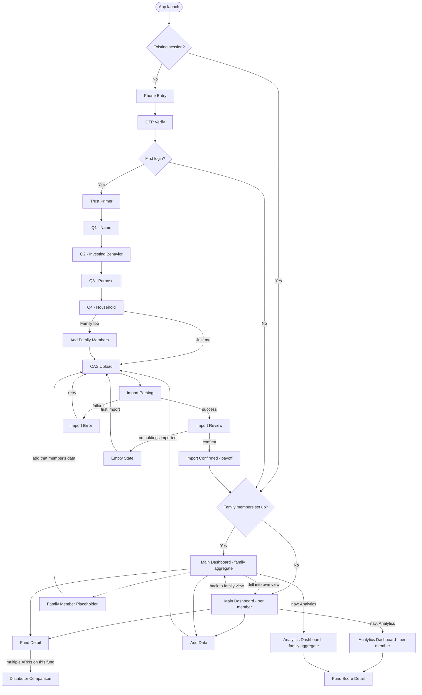
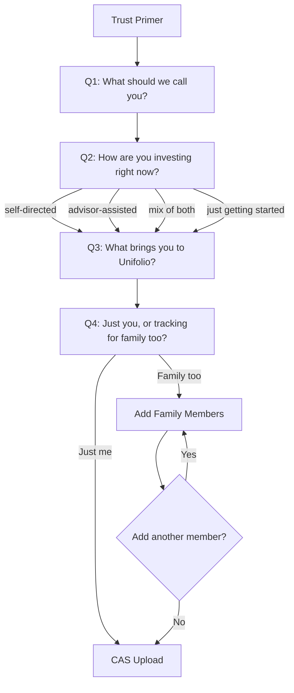
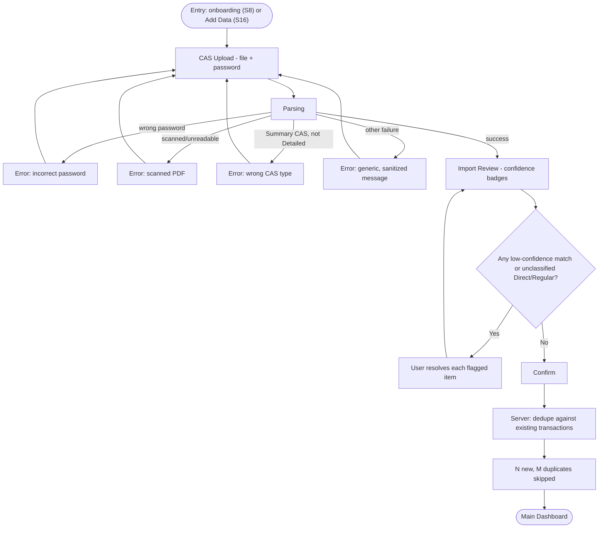

# App Flow: Unifolio

## Purpose

This document connects the four PRDs' user stories into actual navigable flows —
screen to screen, including branches, error states, and where each user story lives.
It's the missing link between "what each module must do" (the PRDs) and "how the
database and TDD need to model it" (next). No visual/interaction design here — that's
the Design Brief/Schema's job — this is structure only: what screen leads to what, and
why.

## Screen Inventory

| ID | Screen | Module / PRD | Entry Points |
|---|---|---|---|
| S0 | Phone Entry | Onboarding (PRD-02) | App launch, no session |
| S1 | OTP Verify | Onboarding (PRD-02) | From S0 |
| S2 | Trust Primer | Onboarding (PRD-02) | First login only, after S1 |
| S3 | Q1 — Name | Onboarding (PRD-02) | After S2 |
| S4 | Q2 — Investing Behavior | Onboarding (PRD-02) | After S3 |
| S5 | Q3 — Purpose | Onboarding (PRD-02) | After S4 |
| S6 | Q4 — Household | Onboarding (PRD-02) | After S5 |
| S7 | Add Family Member(s) | Onboarding (PRD-02) | From S6 if "Family too" |
| S8 | CAS Upload | Import (PRD-01) | From S6 ("Just me") or S7; also from S16 (ongoing) |
| S9 | Import Parsing (loading) | Import (PRD-01) | From S8 |
| S10 | Import Review | Import (PRD-01) | From S9 on success |
| S11 | Import Error | Import (PRD-01) | From S9 on failure (wrong password / scanned / wrong CAS type / generic) |
| S12 | Import Confirmed (payoff) | Import (PRD-01) | From S10 on confirm |
| S13 | Main Dashboard (per-member) | Main Dashboard (PRD-03) | Switch from S14; drill-down view; **also the default** for users with no family members set up (no aggregate to default to) |
| S14 | Main Dashboard (family aggregate) | Main Dashboard (PRD-03) | From S12; **default landing** for returning users who have family members set up |
| S15 | Fund Detail | Main Dashboard (PRD-03) | Tap a holding on S13/S14 |
| S16 | Add Data (re-entry to import) | Main Dashboard (PRD-03) | From S13/S14 nav, routes to S8 |
| S17 | Distributor Comparison | Main Dashboard (PRD-03) | From S15, when a scheme has multiple ARNs |
| S18 | Analytics Dashboard (per-member) | Analytics (PRD-04) | Nav from S13 |
| S19 | Analytics Dashboard (family aggregate) | Analytics (PRD-04) | Nav from S14 |
| S20 | Fund Score Detail | Analytics (PRD-04) | Tap a fund's score on S18/S19 |
| S21 | Empty State — No Holdings Yet | Main Dashboard (PRD-03) | Reached instead of S13/S14 if no import completed |
| S22 | Family Member Placeholder | Main Dashboard (PRD-03) | Within S14, per member with no CAS yet |

## Primary Flow

## Sub-flow: Onboarding Questionnaire (PRD-02 detail)

*Note: per PRD-02 FR-7, every step here is resumable and (aside from Q4's family branch)
skippable — the diagram shows the intended path, not a hard gate.*

## Sub-flow: CAS Import / Review / Confirm (PRD-01 detail)

## Navigation Shell (structural, not visual)

Post-onboarding, the app has one persistent navigation surface reachable from every
authenticated screen (per PRD-03/04's shared nav needs):
- **Dashboard** (S13/S14) — default landing for returning users
- **Analytics** (S18/S19) — same per-member/family-aggregate split as Dashboard
- **Add Data** (S16) — always reachable, not buried in a settings menu, per PRD-01/03's
  Ongoing Data Addition requirement
- **Family/member switcher** — a persistent control, not a separate screen, since both
  Dashboard and Analytics need it identically

Exact placement (footer tools, sidebar, etc. — mentioned in early product direction) is a
Design Schema/prototyping concern, not resolved here — this section only establishes
that these four things must always be reachable, structurally.

## Screen States

Every screen in the inventory above needs, at minimum, these states — called out here
because they affect flow (an error state routes back into the flow, an empty state is a
distinct screen, not a variant to gloss over):

| State | Applies To | Behavior |
|---|---|---|
| Loading | S9 (parsing), S13/S14/S18/S19 (data fetch) | Per Design Brief's "reveal, not pop-in" motion principle |
| Empty | S21 (no holdings), S22 (member placeholder) | Not an error — an invitation to act (Design Brief voice/tone principle) |
| Error | S11 (import failure) | Specific, actionable message per PRD-01's FR-12–14 |
| Stale data | S13/S14/S15 (old NAV), S18/S19 (old TER reference period) | Visually distinct per Design Schema's `color-warning` token, not presented as current |
| Gated/unresolved | S15 (unclassified Direct/Regular), S20 (insufficient history for score) | Labeled explicitly, never silently defaulted |

## Traceability: User Stories → Screens

A sample of the mapping (full mapping should live in the eventual TDD/ticket breakdown,
not duplicated here in full) — enough to confirm every P0 story has a home:

| User Story | Screens |
|---|---|
| PRD-02 US-1 (understand data safety before sharing) | S2 |
| PRD-02 US-2 (family setup during onboarding) | S6, S7 |
| PRD-01 US-2 (see what was parsed before saving) | S10 |
| PRD-01 US-3 (low-confidence matches flagged) | S10 (Resolve branch) |
| PRD-03 US-4 (Direct/Regular visible on holdings) | S13, S14, S15 |
| PRD-03 US-9 (add data anytime post-onboarding) | S16 |
| PRD-04 US-5 (portfolio XIRR vs. benchmarks) | S18, S19 |
| PRD-04 US-7 (cap-wise/overlap) | Not mapped — deferred per PRD-04's standing reminder |

## Open Questions

Both open items from the initial draft are resolved:
- **Default landing**: family aggregate (S14) for returning users who have family
  members set up; per-member (S13) remains default for users without family set up
  (nothing to aggregate). Reflected in the Primary Flow diagram's `HasFamily` branch.
- **S17 (Distributor Comparison) entry point**: confirmed as drawn — reachable only from
  Fund Detail (S15) when a scheme has multiple ARNs, no separate standalone nav item.

None remaining from this pass.

## Appendix

### Related Documents
- PRD-01: CAS Parser v2 — Import flow detail
- PRD-02: Signup & Onboarding — Questionnaire flow detail
- PRD-03: Main Dashboard — Screen inventory, Add Data requirement
- PRD-04: MF Analytics Dashboard — Screen inventory
- Design Brief / Design Schema — motion and empty-state principles referenced in
  Screen States

### Revision History

| Version | Date | Author | Changes |
|---------|------|--------|---------|
| 1.0 | 2026-07-22 | Claude (PM partner) | Initial draft |
| 1.1 | 2026-07-22 | Claude (PM partner) | Default landing resolved to family aggregate (S14) for users with family set up, per-member (S13) as fallback for those without; S17 entry point confirmed as-drawn. Primary Flow diagram updated accordingly. |
