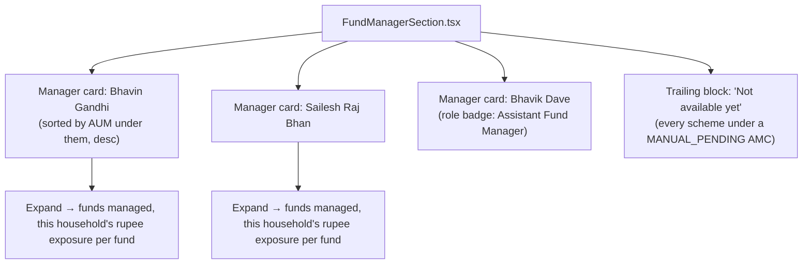

# Attribute 04 — Fund Manager Allocation — Frontend Spec

**Date:** 2026-10-08
**Placement:** New stacked section in the existing Analytics dashboard (`AnalyticsView.tsx`),
sibling to `CategoryRankingSection.tsx`/`TerSection.tsx`.
**Companion artifact:** `artifacts/2026-10-08-attribute-04-fund-manager-visual-map.html`
**Backend source of truth:** `2026-10-07-sub-project-1-planning.md`, "Attribute 04" sections
(lines 1080-1678). This doc restates only what the frontend must render; it is not a second
copy of the backend design.

## 1. What this screen answers

"Which fund managers are actually running my money, and how much is each one responsible
for across my whole portfolio?" — aggregated across every held scheme, grouped by manager,
not scheme-by-scheme.

## 2. Layout — manager-first grouped cards (Option A, Ayush's explicit choice)



- **One card per manager** — including co-managers and assistant managers (Ayush, explicit:
  "agreed, let's give everyone their own card"). A scheme with 2 managers contributes to 2
  cards, not one.
- **Card sort order:** descending by total household rupee value under that manager (the
  "aggregated across the whole portfolio" framing Ayush required) — not alphabetical, not by
  scheme count.
- **Role badge:** shown only when the source data has one (`scheme_fund_managers.role` is
  non-NULL — e.g. Nippon's "Assistant Fund Manager"). When `role IS NULL` (DSP-style,
  unlabeled — the source's own convention for "primary," per `sequence_order = 0`), no badge
  is shown at all — never a fabricated "Primary Manager" label where the source didn't say so.
- **Expand interaction:** tapping a manager card reveals the specific funds this household
  holds under them, with this household's rupee value in each — not that manager's full AMC
  fund list (which could be dozens of schemes the household doesn't hold).
- **Trailing "not available yet" block:** every held scheme whose AMC hasn't resolved yet
  is grouped here, not silently omitted and not attached to a guessed manager. This is a
  small remainder, not the common case — see backend spec §"AMC coverage — every one of the
  57 AMFI-listed AMCs individually checked" for the full per-AMC breakdown: 35 AMCs
  (Tier 1/2, including SBI and ICICI Prudential) have a confirmed, buildable resolver; 12
  more (Tier 3) have a concrete next investigation step already identified; only HDFC,
  Kotak, and Edelweiss are permanently automation-blocked, closed via a monthly
  manual-PDF-intake workflow rather than left unavailable (backend spec's Q1 decision); the
  remaining 7 (Tier 5) may simply have no live retail schemes to resolve. Framed honestly:
  *"Fund manager data for these schemes isn't available yet."*

## 3. Data contract (frontend-relevant shape)

Derived from `scheme_fund_managers` (backend schema, §"Extraction — grounded in two real
factsheet PDFs"):

```ts
type ManagerGroup = {
  managerName: string;
  role: string | null;              // verbatim source label, or null
  totalHouseholdValue: string;      // Decimal string, never a float
  funds: Array<{
    schemeId: string;
    schemeName: string;
    householdValue: string;         // Decimal string
    sequenceOrder: number;          // 0 = unlabeled/primary in source order
  }>;
};

type FundManagerSectionData = {
  managerGroups: ManagerGroup[];     // pre-sorted desc by totalHouseholdValue
  unavailableSchemes: Array<{ schemeId: string; schemeName: string; amcName: string }>;
};
```

No new endpoint design is specified here — this is a read aggregation over the existing
`scheme_fund_managers` table joined against the household's `holdings`, computed the same
way other Analytics sections already aggregate household-held schemes.

## 4. States

| State | Trigger | Treatment |
|---|---|---|
| Normal | Manager has ≥1 resolved scheme held by household | Manager card, per §2 |
| Co-manager / assistant | `scheme_fund_managers` has >1 row for a held scheme | Each manager gets their own card (no merging, no "+1 more") |
| Unavailable | Scheme's AMC is `MANUAL_PENDING` | Trailing block, §2, never a fake manager card |
| Empty section | Household holds zero schemes with any resolved manager (possible but unlikely now that 35 of 57 AMCs resolve) | Section still renders, with the "not available yet" framing as the *only* content — not hidden entirely, so the user understands why, not just an absent section |

## 5. Cross-cutting rules applied here

- Decimal discipline (`@/lib/decimal`) for every rupee value.
- Card chrome, header pattern reused verbatim from `CategoryRankingSection.tsx`.
- No client-side fuzzy matching, scoring, or "best guess" display logic — all matching
  (exact-first, scoped fuzzy fallback, ambiguity guard) happens backend-side per the
  resolver architecture; the frontend only ever renders already-resolved, already-confident
  rows or the explicit "not available yet" state. There is no partial-confidence display
  state in the UI (e.g. no "we think this might be X" treatment) — a row is either resolved
  (shown as fact) or absent (shown as unavailable).

## 6. Explicitly out of scope this pass

- Manager-level bios, tenure history across AMCs, or a standalone "all managers" directory
  — this section is strictly "managers of funds this household holds," not a manager
  encyclopedia.
- Historical manager-change tracking (e.g. "this fund changed managers in 2024") — the
  schema has no versioning for this; only the current `reference_period`'s row is shown.
