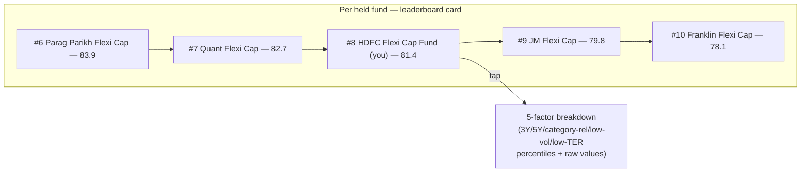

# Attribute 09 — Mutual Fund Ranking — Frontend Spec

**Date:** 2026-10-08
**Placement:** New stacked section in the existing Analytics dashboard (`AnalyticsView.tsx`),
sibling to `CategoryRankingSection.tsx`/`TerSection.tsx`.
**Companion artifact:** `artifacts/2026-10-08-attribute-09-fund-ranking-visual-map.html`
**Backend source of truth:** `2026-10-07-sub-project-1-planning.md`, "Attribute 09" (lines
22-253).

## 1. The design problem this spec had to solve

Before layout, a real conceptual overlap had to be resolved: **Scorer v1** (a standalone
quality score, tier badge, no peer names) and **Category Ranking** (a single-axis return
percentile, no peer names) already exist in this app. Attribute 09's composite formula is a
genuinely different computation (§2 below), but a naive "percentile bar in a card" layout
would have looked and felt like a third copy of the same pattern — raised explicitly by
Ayush: *"does this not feel a lot like the [existing UI]?... where is that difference?"*

Two rejected iterations before arriving at the right answer:
1. **Card + percentile bar** (same shape as Scorer/Category Ranking) — rejected as visually
   redundant, even though the underlying number is different.
2. **Table** (fund / rank / percentile / composite / status columns) — rejected on deeper
   grounds: still didn't show anything Scorer/Category Ranking don't already show (a fund's
   own number), just in a different widget shape.

**Resolved differentiator — the leaderboard/neighbors view:** for each held fund, show its
rank position **with the 2 named competitor funds immediately above and 2 below it** by
name and composite score — "you're #8, here's who's #6, #7, #9, #10." This is the one view
in the app that actually shows *other funds by name*, which is what earns the word
"ranking" — approved by Ayush as the differentiator, then polished to match the real design
system (tokens.css, DM Sans/Manrope, real card chrome) per his request for "a much more
better unique way... matching with the design systems of our app."

## 2. Composite formula (restated for frontend context — not re-derived)

`composite_score = Σ(renormalized_weight × percentile)` across 5 percentile-ranked
components: 3Y return (0.25), 5Y return (0.25), category-relative return (0.20),
low-volatility (0.15), low-TER (0.15). Every component is a **percentile within category**
(0-100), never a raw number summed directly — this is why the frontend never shows a raw
CAGR or TER value as if it were comparable to another component; raw values are shown
alongside their percentile, never instead of it.

## 3. Layout — leaderboard / neighbors view



- Header per card: fund name, category, category size (e.g. "Flexi Cap · 62 funds"), rank
  ("#8 of 62"), percentile ("Top 13%"), composite score.
- Neighbor rows: exactly 2 above + 2 below by rank (fewer at the very top/bottom of a
  category — e.g. rank #1 shows 0 above, 2 below). Each row: rank, fund name, composite
  score — real competitor fund names, not anonymized.
- The held fund's own row is visually distinct (`(you)` tag, accent-tinted background,
  bold) — never just another row in the list.
- Tap-through reveals the 5-factor breakdown: each of the 5 weighted components shown as
  its own percentile + the raw value behind it (e.g. "3Y return (25%) · 92nd pct · 24.1%
  CAGR") — mirrors the "never a bare number, always the evidence behind it" principle the
  backend's `FundRankingRow` schema already follows.

## 4. States

| State | Trigger (`FundRankingRow` fields) | Treatment |
|---|---|---|
| Normal | Ranked, full category context | Leaderboard card, §3 |
| Insufficient history | `insufficient_history = true` (< 3Y NAV history) | Card shows fund name + category, no rank/neighbors — badge: "Insufficient History", text: "Not ranked yet — needs 3 years of NAV history to be eligible." Same floor/copy convention as `CategoryRankingSection.tsx`'s own equivalent state. |
| Thin category | `thin_category = true` (< 5 comparable funds) | Leaderboard still renders (fewer neighbor rows possible), with a "Thin Category (N peers)" badge — same semantics/copy convention as `CategoryRankingSection.tsx`. |
| Category unavailable | No category universe resolvable | "Category Unavailable" badge, same convention as `CategoryRankingSection.tsx`. |
| Missing a component (5Y, TER, or volatility) | `return_5y`/`lowTer.raw`/`lowVolatility.raw` is `null` for this scheme | Composite still computed (weights renormalized backend-side across whichever components are available); frontend shows "—" for that row in the detail breakdown, not a 0 or fabricated value. **Corrected 2026-10-08:** originally scoped to 5Y only — verified against `d331b04` that TER coverage dropped sharply after the exact-only TER rework (migration `0031`, only ~7,000 schemes now exactly-linked), so a missing-TER row is now a common case, not a rare one, and must get the same "—" treatment, not a 0% or omitted-component display. |

## 5. Data contract (frontend-relevant shape)

```ts
type FundRankingRow = {
  schemeId: string;
  schemeName: string;
  categoryName: string;
  categoryUnavailable: boolean;
  insufficientHistory: boolean;
  thinCategory: boolean;
  compositeScore: string | null;      // Decimal string
  categoryRank: number | null;
  categorySize: number;
  percentile: string | null;          // Decimal string
  neighbors: Array<{                  // 2 above + 2 below, omitted entirely when not ranked
    schemeId: string;
    schemeName: string;
    categoryRank: number;
    compositeScore: string;
  }>;
  components: {                       // for the tap-through detail view
    return3y: { percentile: string | null; raw: string | null };
    return5y: { percentile: string | null; raw: string | null };   // raw/percentile both null if <5yr
    categoryRelative: { percentile: string | null; raw: string | null };
    lowVolatility: { percentile: string | null };                  // raw (downside deviation) shown, not weighted direction-flipped
    lowTer: { percentile: string | null; raw: string | null };
  };
};
```

Maps directly to the backend's `GET /analytics/funds/{scheme_id}/ranking` /
`FundRankingRow` schema — no frontend-invented fields beyond `neighbors` (an aggregation
the API returns pre-computed, not derived client-side, so the leaderboard ordering is
never recomputed in the browser from a raw category list).

## 6. Cross-cutting rules applied here

- Decimal discipline for every percentage/score value.
- Badge copy/variants (`Insufficient History`, `Thin Category (N peers)`, `Category
  Unavailable`) reused verbatim from `CategoryRankingSection.tsx` — same wording, same
  `Badge` component variants, so a user who's already seen these states elsewhere in
  Analytics doesn't have to learn new vocabulary for the same underlying condition.
- No client-side ranking/scoring logic — the composite score, percentiles, and neighbor
  list are all pre-computed server-side; the frontend only renders.

## 7. Explicitly out of scope this pass

- Historical ranking trend (e.g. "this fund moved from #12 to #8 over 6 months") —
  `scheme_rankings` has no trend query designed in this pass; only the latest `computed_at`
  row is shown.
- Cross-category comparison (e.g. ranking a Flexi Cap fund against a Large Cap fund) — the
  entire mechanic is category-scoped by design, per the backend's own percentile-within-
  category computation.
