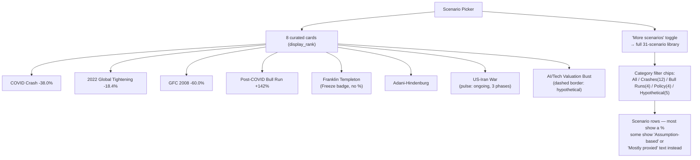
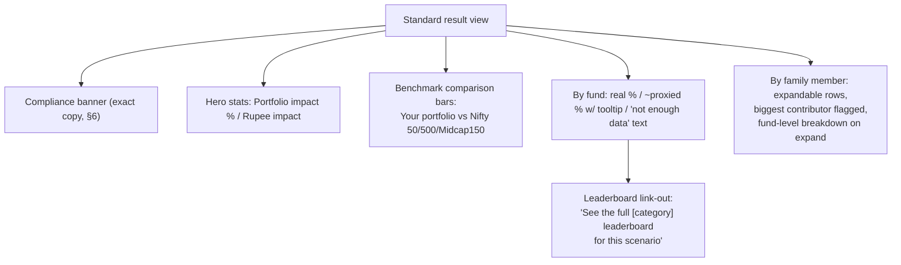
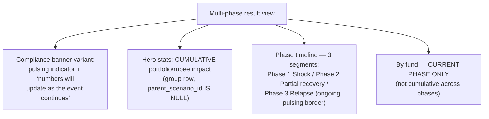
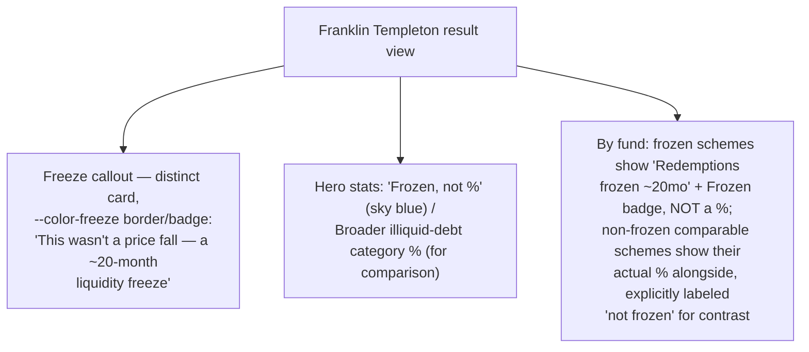
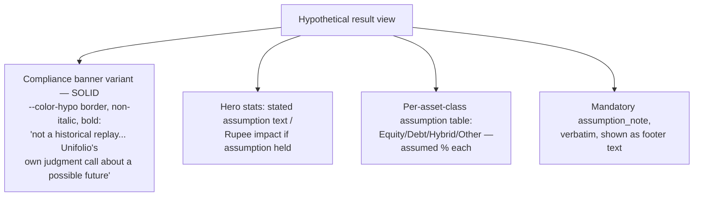

# Attribute 11 — Drawdown / Scenario Simulator — Frontend Spec

**Date:** 2026-10-08
**Placement:** New top-level nav route, `Scenarios`, sibling to `Holdings`/`Analytics`/`Profile`
— Ayush's explicit choice (Option B): the picker + 4 distinct result shapes don't fit as one
more stacked Analytics card.
**Companion artifact:** `artifacts/2026-10-08-attribute-11-scenario-simulator-visual-map.html`
**Backend source of truth:** `2026-10-07-sub-project-1-planning.md`, "Attribute 11" (lines
256-1004).

This is the most data-dense and most-iterated of the 4 screens — it went through 2 mockup
passes. The first (picker + single flat result shape) was explicitly rejected by Ayush as
too shallow: *"we need to push the limits here... use every single thing that we are going
to get... in the back-end side."* The second — this spec's basis — uses every structural
element the backend actually computes: benchmark comparison, multi-phase timelines,
the Franklin Templeton special case, and the hypothetical-assumption treatment.

## 1. What this screen answers

"How would my current portfolio have fared through a real (or hypothetical) market event,
and who in my household would have felt it most?" — the family-level rupee breakdown is,
per Ayush, "the differentiator" of this feature.

## 2. Screen 1 — Scenario picker



- **Curated 8** (confirmed, backend's `display_rank` ascending): COVID crash, 2022 global
  tightening, GFC (2008), Post-COVID bull run, Franklin Templeton wind-up, Adani-Hindenburg,
  US-Iran war, AI/tech valuation bust. `GET /scenarios?curated=true`.
- Each curated card shows a quick-stat preview in the top-right corner (e.g. "-38.0%"),
  except: the Franklin card (shows a "Freeze" badge instead of a %, since its data is a
  liquidity freeze, not a price move — see §5) and the ongoing US-Iran card (shows a pulsing
  "ongoing" indicator instead of a settled final %, since the event hasn't concluded).
- Hypothetical-category cards get the dashed-border + `--color-hypo` violet treatment,
  distinct from every other card, at the picker level already — the visual distinction
  starts before the user even opens the result.
- **"More scenarios"** expands the full 31-scenario library (`GET /scenarios`, no
  `curated` param), filterable by the 4 backend `scenario_type` categories (Crashes/Bull
  Runs/Policy-Rate/Hypothetical). Rows here show a settled % for scenarios with real data,
  or text ("Assumption-based", "Mostly proxied — pre-dates most schemes") where the
  honest-data floor applies — never a fabricated number.

## 3. Screen 2 — Result views (4 distinct data shapes)

The backend's scenario taxonomy produces genuinely different result shapes, not one
template with optional fields. The frontend has 4 distinct result-view components, chosen
by which shape a given scenario's data takes:

### 3a. Standard (majority of scenarios — e.g. COVID Crash)



- **Benchmark comparison**: portfolio's % plotted alongside Nifty 50/500/Midcap 150 as
  horizontal bars, portfolio bar in the negative/positive accent color, benchmarks in
  `--color-text-secondary` — this is new, wasn't in the v1 mockup, added specifically to
  use backend data (`scenario_category_averages`-adjacent comparison) the first pass
  ignored.
- **By fund**: each held fund's scenario % — real (`is_proxied=false`, shown exact, no
  caveat), proxied (`~` prefix, nearest-5%-band, dotted-underline tooltip explaining the
  proxy basis verbatim, e.g. "shown using the Large Cap category average"), or absent
  (`pct_change IS NULL`, rendered as the literal text "Not enough historical data to
  estimate" — never a blank, zero, or dash that could be misread as a real value).
- **Leaderboard link-out**: "See the full [category] leaderboard for this scenario
  (best/worst of N funds)" — a forward link into attribute 09's ranking surface, using
  this scenario's category-relative data; not a new computation, a cross-reference.
- **By family member**: `household_member_id`-grouped rows, `rupee_impact` descending
  (biggest loss first), biggest contributor labeled. Each row expands (tap) to the
  member's own fund-level breakdown. **This interaction is accepted as the functional
  baseline for now** — Ayush flagged it for a later UI/UX polish pass once functionality
  is confirmed working; this spec does not block on that polish (see consolidated spec
  §5).

### 3b. Multi-phase, ongoing (e.g. US-Iran War)



- Group row (whole-event dates, cumulative %) renders the hero stats; each phase row
  (`phase_label`/`phase_order`) renders as its own stepper segment with its own dates and
  its own %. The ongoing phase gets a distinct border color (`--color-negative` border,
  per the mockup) plus the same pulsing dot used at the picker level — visual continuity
  between "this card is ongoing" at the picker and "this phase is ongoing" in the result.
- "By fund" in this view shows the **current phase's** per-fund %, not a cumulative
  figure — matches the backend's phase-scoped `scenario_scheme_results` rows.
- This structure generalizes to any future multi-phase scenario, not just US-Iran — the
  component doesn't hardcode phase count or labels.

### 3c. Special case: redemption freeze (Franklin Templeton only)



- This is the one scenario where a percentage figure would be actively misleading — the
  backend's `had_redemption_freeze_schemes` flag drives a structurally different template,
  not a variant of the standard one. The hero stat literally reads "Frozen, not %" rather
  than a number, in the flagged `--color-freeze` (`#38BDF8`) one-off color.
- The second hero stat shows the broader (non-frozen) illiquid-debt category's actual
  price fall as a comparison figure, alongside the "Frozen, not %" result for a scheme
  that held a frozen scheme, so the user can see both "what actually happened to you" and
  "what the comparable market move was" side by side.

### 3d. Hypothetical (category D — e.g. AI/Tech Valuation Bust)



- No benchmark comparison, no per-fund breakdown, no family-member breakdown — a
  hypothetical scenario has no NAV replay at all (pure `current_value * (1 +
  assumed_pct_change/100)` arithmetic per asset-class bucket), so there's no real
  per-fund/per-member granularity to show; showing fake-precision fund rows for a
  judgment-call number would violate the honest-data floor.
  `scenario_hypothetical_assumptions`' mandatory `assumption_note` is always rendered,
  never omitted — it's the only thing that makes a hypothetical number legible as
  "someone's stated judgment," not "computed fact."
- **Added 2026-10-08, resolved same day: "assumptions not set yet" state.** This was
  briefly a real gap — 4 of the 5 seeded category-D hypotheticals (Strait of Hormuz
  closure, US recession + Fed pivot, Rupee sharp depreciation, Indian equity "lost decade")
  originally had zero `scenario_hypothetical_assumptions` rows. **All 5 are now seeded**
  (backend doc's attribute 11 section has the real Equity/Debt/Hybrid/Other values +
  notes, orchestrator-authored per Ayush's delegation). The `assumptions_not_set` state
  below is kept anyway, as correct generic handling for any *future* hypothetical an admin
  adds via the DB-entry pattern before seeding its assumptions — not because any of
  today's 5 scenarios need it right now. If `assumptions_not_set = true`: render no hero
  stat, no assumption table, and no rupee figure at all — literal text, *"We haven't set
  an assumption for this scenario yet — check back soon."* — never a 0% or blank-table
  result. **Decided 2026-10-08 (orchestrator recommendation, Ayush delegated): shown, not
  hidden.** Such a scenario stays reachable from "More scenarios" with this explicit state,
  rather than disappearing from the picker — consistent with every other missing-data
  state in this sub-project (04's "not available yet" block, 09's "Insufficient History"
  badge, the historical-scenario proxy fallback's "no comparable data" text), none of which
  hide; all state the gap explicitly. See backend doc's attribute 11 section for the full
  reasoning.

## 4. Picker-to-result dispatch logic

```ts
type ScenarioResultShape = "standard" | "multi_phase" | "redemption_freeze" | "hypothetical";

function resolveResultShape(scenario: ScenarioSummary): ScenarioResultShape {
  if (scenario.scenarioType === "HYPOTHETICAL") return "hypothetical";
  if (scenario.hadRedemptionFreezeSchemes?.length) return "redemption_freeze";
  if (scenario.parentScenarioId === null && scenario.hasPhases) return "multi_phase";
  return "standard";
}
```

This dispatch is a pure function of backend-provided scenario metadata — the frontend
never guesses which shape to render from scenario name or category alone (e.g. a future
non-Franklin scenario that also happens to be a Crash must not accidentally render as
`redemption_freeze` just because it's a debt-fund crash; only the explicit flag triggers
that template).

## 5. States

| State | Trigger | Treatment |
|---|---|---|
| Real data | `is_proxied = false` | Exact %, no caveat |
| Proxied | `is_proxied = true`, `proxy_basis` set | `~` prefix, nearest-5% band, dotted-underline tooltip with verbatim `proxy_basis` text |
| No comparable data | `pct_change IS NULL`, `proxy_basis='no_comparable_data'` | Literal text "Not enough historical data to estimate" — never a number |
| Ongoing (group or phase) | `is_ongoing = true` | Pulsing dot indicator + "numbers will update as the event continues" in the compliance banner |
| Redemption freeze | `had_redemption_freeze_schemes` non-empty | Freeze callout + "Frozen, not %" hero stat, §3c |
| Hypothetical | `scenario_type = HYPOTHETICAL` | Solid distinct-color banner, assumption table, §3d |
| Hypothetical, assumptions not set | `scenario_type = HYPOTHETICAL`, `assumptions_not_set = true` | No hero stat, no assumption table, no rupee figure — literal "We haven't set an assumption for this scenario yet — check back soon." Shown (not hidden) in "More scenarios," §3d. Not triggered by any of today's 5 seeded hypotheticals — generic handling for a future one. |

## 6. Compliance framing — exact copy (shipped default, not yet SEBI-cleared)

Every non-hypothetical historical-percentage display carries, verbatim:

> "Here's what this portfolio would have captured during [period], based on actual
> historical fund performance — not a prediction of future returns."

Ongoing scenarios append: *"Numbers will update as the event continues."*

Hypothetical scenarios use a structurally different, non-italic, solid-bordered banner
instead:

> "This is a hypothetical scenario based on a stated assumption, not a historical replay.
> No market event has happened — these numbers are Unifolio's own judgment call about a
> possible future, not fact."

This is a working default Ayush has asked to ship now; remove or amend only if a SEBI
consultant review later objects — not a frontend decision to revisit independently.

## 7. Data contract (frontend-relevant shape, trimmed to what §3's views consume)

```ts
type ScenarioSummary = {
  scenarioId: string;
  name: string;
  scenarioType: "CRASH" | "BULL_RUN" | "POLICY_RATE" | "HYPOTHETICAL";
  startDate: string;
  endDate: string | null;
  isOngoing: boolean;
  displayRank: number | null;         // null = not in curated 8
  parentScenarioId: string | null;
  hasPhases: boolean;
  hadRedemptionFreezeSchemes: string[] | null;
  quickStatPct: string | null;        // Decimal string, null for freeze/ongoing-unsettled cards
};

type ScenarioResult = {
  scenario: ScenarioSummary;
  portfolioImpactPct: string | null;
  rupeeImpact: string;                // Decimal string
  benchmarks: Array<{ name: string; pct: string }>;   // standard view only
  phases: Array<{                      // multi_phase view only
    label: string; order: number; startDate: string; endDate: string | null;
    isOngoing: boolean; pct: string;
  }>;
  byFund: Array<{
    schemeId: string; schemeName: string;
    pct: string | null; isProxied: boolean; proxyBasis: string | null;
    isFrozen: boolean;                 // redemption_freeze view only
  }>;
  byMember: Array<{                    // standard + multi_phase views
    householdMemberId: string; memberName: string; rupeeImpact: string;
    funds: Array<{ schemeId: string; schemeName: string; rupeeImpact: string | null }>;
  }>;
  hypotheticalAssumptions: Array<{      // hypothetical view only
    assetClass: "Equity" | "Debt" | "Hybrid" | "Other";
    assumedPctChange: string; assumptionNote: string;
  }>;
  assumptionsNotSet: boolean;           // hypothetical view only, added 2026-10-08 — false
                                        // for all 5 seeded hypotheticals today (all now have
                                        // real assumption rows); kept for a future unseeded
                                        // hypothetical, see §3d/§5
};
```

## 8. Cross-cutting rules applied here

- Decimal discipline throughout; `quickStatPct`/`portfolioImpactPct`/`rupeeImpact` etc. are
  all Decimal strings, never floats.
- Locked tokens (`tokens.css`) for every color except the two flagged one-off exceptions
  (`--color-hypo` `#A78BFA`, `--color-freeze` `#38BDF8`) — scoped to this screen only, not
  reusable elsewhere without separately confirming with Ayush (consolidated spec §2).
- No client-side proxy/phase/freeze computation — `resolveResultShape` (§4) only reads
  backend-provided flags; it never infers a scenario's shape from its name, category, or
  date range.
- Honest-data floor: a `null` `pct_change` always renders as the literal "not enough
  historical data" text, never a blank/zero/dash.

## 9. Explicitly out of scope this pass

- Family-member card interaction's visual/UX polish — functional expand/collapse accepted
  now, richer treatment (per Ayush) deferred to a later pass; see consolidated spec §5.
- "Correlation X-Ray" (e.g. cross-referencing a directly-held Adani stock against the same
  stock's exposure inside a held fund during the Adani-Hindenburg scenario) — depends on
  Sub-project 2's look-through engine, tracked in `DEFERRED_FEATURES.md`.
- Scenario comparison (viewing 2+ scenarios side by side) — each result view renders
  exactly one scenario at a time.
- Admin editing UI for `ranking_weights`/`scenario_hypothetical_assumptions` — edited via
  existing SSM-tunnel + psql/DBeaver access, same as all other DB-backed config in this
  app; no in-app admin surface this pass.
