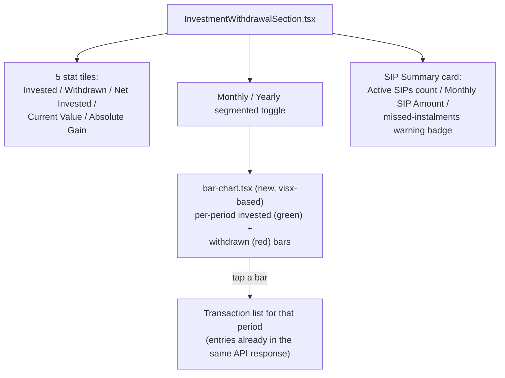

# Attribute 14 — Investment & Withdrawal Analysis — Frontend Spec

**Date:** 2026-10-08
**Placement:** New stacked section in the existing Analytics dashboard (`AnalyticsView.tsx`),
sibling to `AllocationSection`/`BenchmarkSection`/`CategoryRankingSection`/`ScorerSection`/
`TerSection` — Ayush's explicit correction from an earlier own-page suggestion: *"I don't
see it having its own page... but I can add that as a section."*
**Companion artifact:** `artifacts/2026-10-08-attribute-14-investment-withdrawal-visual-map.html`
**Backend source of truth:** `2026-10-07-sub-project-1-planning.md`, "Attribute 14" (lines
1794-1945).

User note on the approved mockup: *"Feels like it can be reworked a lot, but for now this
works. We'll rework on this a little bit more later"* — accepted as the functional baseline
for implementation, not a final-polish sign-off; a later visual-design pass is expected and
does not block this spec.

## 1. What this screen answers

"How much have I put in, taken out, and what's it worth today?" — portfolio-level only.
Fund-level drill-down was flagged as a genuine scope fork and explicitly deferred by Ayush
(see backend doc's "Future phase 2"); this spec covers portfolio-level only.

## 2. Layout



- **5 tiles**, left to right: Invested, Withdrawn (negative-color), Net Invested, Current
  Value (accent-color), Absolute Gain (positive/negative by sign). Formulas restated for
  frontend context only (not re-derived — backend doc has the full worked-example
  sanity-check):
  `net_invested = total_invested - total_withdrawn`;
  `absolute_gain = current_value + total_withdrawn - total_invested`.
- **Monthly/Yearly toggle**: switches the same bar chart between `monthly[]` and `yearly[]`
  response arrays — no separate fetch, both are present in the one API response (§4).
- **Bar chart**: new `components/ui/charts/bar-chart.tsx`, built on the already-installed
  `@visx/group`/`@visx/responsive`/`@visx/shape`/`d3-shape` stack that already powers
  `pie-chart.tsx` — no recharts or any new charting dependency (ladder/ponytail rule:
  already-installed dependency solves it). Each period renders two bars (invested/green,
  withdrawn/red) side by side.
- **Tap-a-bar-for-transactions**: tapping any period's bar(s) opens that period's
  transaction list. This requires no second network round-trip — the backend's response
  shape already embeds each bucket's own `entries: CashFlowEntry[]` (§4), so the frontend
  only ever filters/displays data it already has in memory.
- **SIP Summary card**: Active SIPs count, Monthly SIP Amount, and a missed-instalments
  warning badge (shown only when `missed_count > 0`) — wires in the existing
  `compute_active_sips`/`compute_sips_for_month` backend logic; the frontend does not
  recompute SIP status.

## 3. States

| State | Trigger | Treatment |
|---|---|---|
| Normal | Has transaction history | Full 5-tile + chart + SIP card, §2 |
| No SIPs | `sip.active` empty | SIP card shows "No active SIPs" instead of the count/amount pair, no missed-instalment badge |
| Missed instalments | `sip.missed_count > 0` | Warning-colored badge: "N missed instalments" |
| Empty period (no transactions in a given month/year) | Bucket present with zero invested/withdrawn | Bar renders at zero height, not omitted from the axis — keeps the timeline continuous rather than compressing around gaps |
| New household, no transactions at all | Empty `monthly`/`yearly` arrays | Section renders tiles at ₹0 and an empty-state message in place of the chart (e.g. "No transactions yet") — never a chart rendered against an empty array as if it were real zero-activity data |

## 4. Data contract (frontend-relevant shape)

Maps directly to the backend's `GET /household/aggregate/investment-withdrawal`:

```ts
type CashFlowEntry = {
  transactionId: string;
  schemeName: string;
  date: string;
  amount: string;               // Decimal string
  direction: "invest" | "withdraw";
};

type PeriodBucket = {
  period: string;                // "2026-03" (monthly) or "2026" (yearly)
  invested: string;               // Decimal string
  withdrawn: string;               // Decimal string
  net: string;                     // Decimal string
  entries: CashFlowEntry[];        // tap-a-bar drill-in source, no second fetch
};

type SipRow = {
  schemeName: string;
  sipAmount: string;
  status: "active" | "stopped";
  missedInstalments: number;
};

type InvestmentWithdrawalData = {
  tiles: {
    totalInvested: string; totalWithdrawn: string; netInvested: string;
    currentValue: string; absoluteGain: string;
  };
  monthly: PeriodBucket[];
  yearly: PeriodBucket[];
  sip: {
    active: SipRow[];
    totalMonthlySipAmount: string;
    missedCount: number;
  };
};
```

## 5. Cross-cutting rules applied here

- Decimal discipline (`@/lib/decimal`) for every rupee value — all fields above are Decimal
  strings, never floats.
- Card/tile chrome reused verbatim from other Analytics sections (`TerSection.tsx`-style
  stat tiles).
- No client-side SIP-status or missed-instalment computation — `compute_active_sips`'s
  output is rendered as-is; the frontend does not independently decide what counts as
  "missed."
- No new charting dependency — `bar-chart.tsx` is a new sibling file reusing the exact
  stack `pie-chart.tsx` already uses, not a new library.

## 6. Explicitly out of scope this pass

- **Fund-level drill-down** (per-scheme invest/withdraw, with `SWITCH_IN`/`SWITCH_OUT`
  reclassified as fund-level investment/withdrawal) — a confirmed, explicit scope fork,
  fully designed in the backend doc's "Future phase 2" section but not built; no trigger
  for revisiting identified, purely "if a future need is identified."
- **Switch/STP activity at portfolio level** — correctly excluded from both invested and
  withdrawn totals, per the PDF's own classification table and `cash_flow.py`'s existing
  `_DEBIT_TYPES`/`_CREDIT_TYPES` sets; not a gap, a deliberate reuse of existing
  classification logic.
- Gift/bonus transactions (`GIFT_IN`/`GIFT_OUT`/`BONUS`) — excluded from totals, following
  `cash_flow.py`'s own existing "not cash" precedent (flagged explicitly in the backend
  doc as a real decision, not an oversight).
