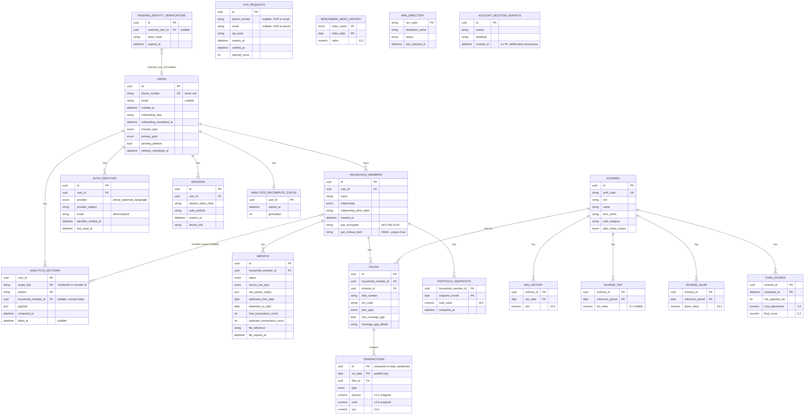
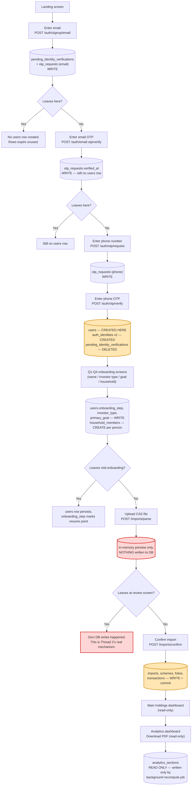

# Unifolio — Database Schema & User Journey Review

**Date:** 2026-09-23
**Author:** Engineering (Claude Code, reviewed by Ayush Karnawat)
**Audience:** Stakeholders / QA — reference for the ongoing signup, CAS-import, and CAS-parsing investigation
**Status:** Investigation reference document — no fixes have been made yet; this is the shared factual baseline the team is working from before deciding on fixes.

---

## 1. Purpose of this document

Three engineering issues were flagged by QA:

1. Partial signups (stopped at the mobile or email step) appear to be recorded outside the `users` table.
2. CAS file data appears to be read during import but never written to the database.
3. A 10-year CAS file parses correctly, but the data displayed to the user is still wrong.
4. CAS files spanning 10 years parse differently — and less correctly — than shorter files covering the same portfolio.

Before proposing fixes, we traced the actual code path for every step of a user's journey — from account creation through to viewing the Analytics dashboard — to establish exactly which table and column each action writes to. This document is that trace, presented as:

- A full entity-relationship (ER) diagram of the schema as it exists in the codebase today.
- A table-by-table, column-by-column explanation of *why* each piece of data exists.
- A step-by-step walkthrough of the user journey, including what happens in the database if a user abandons the flow partway through.
- A summary of what each QA-reported issue actually is, based on this trace.

**No fixes are proposed in this document.** Each issue will get its own bounded design and fix once the root cause is confirmed.

---

## 2. Entity-Relationship Diagram

**Two tables are deliberately drawn with no connection to a user account:**

- `otp_requests` — exists specifically so an unverified signup attempt never has to touch the `users` table at all.
- `account_deletion_surveys` — deliberately anonymous; "why did you leave" feedback is designed to survive independently of the account it came from.

`benchmark_index_history` and `arn_directory` also have no user-linked connection, but for a different reason: they are reference data — facts about the market, not about any individual user — shared platform-wide.

---

## 3. Schema walkthrough: why each table and column exists

### 3.1 Account & identity tables

**`users`** — the single row that represents an account. Every other user-owned table ultimately connects back to this row (directly, or via `household_members`).

| Column | Why it exists |
|---|---|
| `phone_number` | The root identity of an account. Never blank, always unique — every code path that creates a user sets this. |
| `email` | Optional — a phone-only signup never has one. |
| `onboarding_step` | Tracks which onboarding screen a user last completed, so a resumed session lands back where they left off. |
| `onboarding_completed_at` | Blank until onboarding is finished — this is what gates access to the main dashboard. |
| `investor_type`, `primary_goal` | Captured during onboarding questions, used for personalization only. |
| `pending_deletion`, `deletion_scheduled_at` | Support account deletion with a grace period before permanent removal. |

**`household_members`** — the actual unit a portfolio is attached to. This exists so one login can manage multiple people's portfolios (self, spouse, parent, child) — every import, folio, transaction, and snapshot connects to a `household_members` row, not directly to the account. A "self" member is created the same way any other family member is; there is no separate concept of a "primary" person in the schema.

| Column | Why it exists |
|---|---|
| `relationship` / `relationship_other_label` | Common relationship types are a fixed list; "other" allows free text without needing a schema change for every new label. |
| `pan_encrypted` / `pan_lookup_hash` | PAN is retained (encrypted) instead of the raw CAS file, so a future re-import can recognize "this PAN already belongs to a household member" without ever storing PAN in plain text. The lookup hash is enforced unique across the whole platform — one PAN can only ever belong to one household member, system-wide. |

**`auth_identities`** — one row per verified login method (phone, email, or Google), not one row per user. A single account can have all three, each independently verified.

**`pending_identity_verifications`** and **`otp_requests`** — the "before an account exists" holding area. These two tables are where a signup attempt lives while only one of email/Google or phone has been verified. No `users` row exists at this stage.

**`sessions`** — the record checked on every request to confirm a user is logged in.

### 3.2 Import & portfolio tables

**`imports`** — one row per CAS file upload attempt, tracking its status end-to-end (uploaded → parsing → confirmed / failed / expired), independent of whether it ultimately succeeded. Stores the full parsed output as a durable record for troubleshooting, since the original PDF is deleted after a short retention period.

**`folios`** — one row per physical AMC folio a household member holds. A person can hold the same fund under two different folio numbers, so folios are tracked per folio number, not just per fund. Includes a flag for when an imported statement doesn't cover a folio's full history (a "coverage gap"), relevant to the 10-year vs. 7-year discrepancy investigation.

**`transactions`** — the actual transaction ledger. Partitioned by year for performance at scale. Re-uploading the same or an overlapping CAS file is safe — duplicate transactions are detected and skipped rather than double-counted.

### 3.3 Reference data (shared across all users)

**`schemes`, `nav_history`, `scheme_ter`, `scheme_aaum`, `arn_directory`, `benchmark_index_history`, `fund_scores`** — facts about mutual funds and market benchmarks that are true for every user who holds them (fund NAV history, expense ratios, AUM, distributor status, benchmark index levels, computed fund scores). None of these are tied to a specific user — they're refreshed once, platform-wide, rather than once per user.

### 3.4 Analytics & account lifecycle

**`portfolio_snapshots`** — one row per household member per month, a precomputed running total used for "value over time" charts without re-summing every transaction on every page load.

**`analytics_sections`** / **`analytics_recompute_status`** — the Analytics dashboard never computes anything live; every section is a precomputed row read from here. A background job recomputes all sections for a household in one pass.

**`account_deletion_surveys`** — anonymous exit feedback, intentionally disconnected from the account that submitted it.

> **Note on documentation drift:** the previously existing schema reference doc (`Docs/PRDs/Database-Schema-Unifolio.md`, last updated 2026-09-02) does not yet reflect `pending_deletion`/`deletion_scheduled_at` on `users`, or the `account_deletion_surveys`, `analytics_sections`, and `analytics_recompute_status` tables — all of which exist in the current codebase. This document is built directly from the current code, not from that doc.

---

## 4. User journey walkthrough

This traces a new user from account creation through to viewing Analytics, showing exactly what gets written to the database at each step — including what happens if the user leaves partway through.

### Step-by-step detail

| Step | What the user does | What gets written | If the user leaves here |
|---|---|---|---|
| 1 | Enters email on the signup screen | A pending verification record + an OTP request record are created | **No account is created.** These records simply expire unused. |
| 2 | Enters the email OTP | The OTP request is marked verified | **Still no account.** Only the pending verification record now reflects "email verified." |
| 3 | Enters phone number | A second OTP request record is created (for phone) | Still no account. |
| 4 | Enters the phone OTP | **The account is created here** — this is the only point in the entire signup flow where a `users` row is written, and it only happens once both email and phone are independently verified | N/A — account now exists |
| 5 | Answers onboarding questions (name, investing style, goals, family members) | The existing account record is updated; a household member record is created for each person added | The account persists; onboarding simply resumes where they left off next time |
| 6 | Uploads a CAS file | The file is parsed and shown on-screen for review, but **nothing is saved to the database at this stage** | **Nothing is persisted.** This is a deliberate preview step — the parsed data is held only in memory until the user confirms it. |
| 7 | Confirms the import | The import record, fund records, folio records, and every transaction are written to the database | N/A — data is now saved |
| 8 | Views the main dashboard | Read-only — no new data written | — |
| 9 | Views Analytics / downloads PDF | Read-only — reads precomputed analytics rows | — |

---

## 5. What this means for each reported issue

### Issue 1 — Partial signups recorded outside `users`

**Not a defect in the sense originally described.** An account cannot be created with only a phone number or only an email — the code path that creates an account requires both to be independently verified first, and does so as a single atomic step. What was likely observed in the database was a *pending verification* or *OTP request* record — which is working as designed, not an account.

There is a related, genuine **open design question**: today, the account is created immediately after phone verification succeeds — *before* the user confirms their name and other onboarding details, and *before* any CAS import. If the intent is for account creation to happen later (e.g., only after the user confirms their name, or only after a CAS import completes), that is a deliberate product decision to make, not a bug to fix — and pushing account creation out until after CAS import would require a larger restructuring, since imports currently depend on an account already existing.

### Issue 2 — CAS data read but never written

**Not accurate as a blanket statement.** When a user completes the import (confirms the reviewed data), everything is written to the database correctly. The real, concrete gap is the **review screen between upload and confirmation** — during that window, the parsed data is shown to the user but deliberately not yet saved, so that leaving at that point saves nothing. This may be working as intended (a preview should be abandonable without side effects), or it may be the actual behavior to change — that's a product decision.

### Issues 3 & 4 — 10-year CAS file parsing discrepancies

Unifolio's own import code has no logic that treats files differently based on how many years they span. The discrepancy is very likely inside the third-party PDF-parsing library used to read CAS statements, in the logic that detects page breaks and fund-section boundaries within the PDF — a longer document has more of these boundaries, and more opportunity for that detection to misfire. Confirming this requires running the actual 7-year and 10-year CAS files for the same portfolio side by side and comparing the parsed output — those two files are needed from the user to proceed further on this issue.

---

## 6. Next steps

1. Confirm the intended design for Issue 1 (when should an account record actually be created).
2. Confirm whether the Issue 2 review-screen behavior (nothing saved until confirm) is expected or should change.
3. Obtain the 7-year and 10-year CAS files for the same portfolio to root-cause Issues 3/4.

Each issue will then get its own independent, bounded fix — reviewed and shipped separately, since they touch unrelated parts of the codebase.
