# Deep Understanding — Mutual Fund Portfolio Analytics PDF (the build target)

**Date:** 2026-10-06
**Source:** `Docs/Unifolio_MF_Portfolio_Analytics_Requirements.pdf` — stakeholder-authored,
Sept 2026, "For build." **This is the analytics build target**, not the current state.
**Companion docs:** `Docs/orchestration/2026-10-06-analytics-pdf-attribute-gap-analysis.md`
(the scorecard/open-questions doc from the first pass) and
`Docs/orchestration/2026-10-06-analytics-pdf-visual-map.html` (the visual/diagram companion
to this doc).
**Purpose:** go deep enough into every formula, definition, example and UI intent in the PDF
that planning conversations can reference *this* doc instead of re-reading the PDF, while
staying honest about exactly where today's codebase already satisfies each piece and where it
doesn't.

---

## 1. The philosophy underneath all 15 attributes

The PDF is built on one architectural decision, stated on its own page before any attribute is
introduced: **analyze the client's whole mutual fund portfolio as one portfolio, never fund by
fund.** The reasoning is concrete, not abstract — a client holding 8-10 funds can believe they're
diversified while those funds quietly buy the same stocks, share a fund manager, or sit with the
same AMC. You can't see that without opening every fund up to its actual securities and adding
the results together. That single idea is why the PDF's attribute 00 ("the look-through engine")
sits before attribute 01 and is framed as infrastructure, not a feature — six of the other
fourteen attributes are explicitly described as reading from the one table it produces, rather
than each computing its own version of "what does this client actually hold."

Five rules recur across every one of the 15 attribute pages, stated once up front as "golden
rules for every screen," and worth internalizing because they constrain *how* every attribute
below must be implemented, not just what it calculates:

1. **Weights are always by current market value** — never by amount invested, never a simple
   average across funds. (This rules out a shortcut that would otherwise look tempting for
   several attributes below — e.g. attribute 06's stock exposure is *not* `8% + 6% + 5%`, see
   its own section.)
2. **Every widget shows an "as on" date**, and NAV dates and holdings-disclosure dates are
   allowed to differ — holdings are disclosed monthly, NAVs daily. The PDF's own example:
   "Values as on 29 Sep 2026 · Holdings as on 31 Aug 2026."
3. **Every number is clickable**, with a standard drill-down path: Portfolio → AMC → Fund →
   Stock / Transaction. Each attribute section below names its specific drill-down, but they're
   all instances of this one pattern.
4. **Hypothetical numbers are always labelled** — anything back-tested on current holdings
   carries a "Back-tested" tag. This shows up explicitly in attributes 11 and 12.
5. **Indian number formats everywhere** — ₹1,00,000 grouping, lakh/crore short forms, 2-decimal
   percentages.

---

## 2. Section 00 — the look-through engine itself

**The one formula that powers most of the document:**

```
Client exposure to a security = Σ over all funds ( Fund weight in client portfolio × Security weight inside that fund )

Fund weight    = current value of that scheme ÷ total MF portfolio value
Security weight = that security's % of the fund's net assets, from its monthly portfolio disclosure
```

The PDF is explicit that this should be **built once as a shared service** — stock exposure,
sector split, market-cap split, asset allocation, overlap, P/E, P/B and concentration alerts all
read from the same look-through table instead of each feature re-deriving it.

**What this actually requires, concretely:** for every scheme a client holds, the engine needs
that scheme's current stock-level portfolio — every security it holds and what % of the fund's
net assets that security represents, as of the fund's most recent monthly disclosure. **This
data does not exist anywhere in the Unifolio codebase today.** The existing `schemes` table
(per `Docs/PRDs/Database-Schema-Unifolio.md`) carries scheme-level metadata only — `amc_name`,
`sebi_category`, `isin` (of the *scheme* itself, not its holdings) — nothing about what the
scheme's portfolio manager has actually bought. Nothing comparable to `nav_history` or
`scheme_ter` (which the codebase already ingests on a recurring cadence from AMFI) exists for
stock-level holdings, because AMFI doesn't publish this centrally — each AMC discloses its own
funds' portfolios separately, monthly, in its own PDF/Excel format. This is the single largest
build item implied by the whole PDF, and the dependency that blocks attributes 02, 06, 10, 13
and 15 below (04's fund-manager data is a separate, much smaller gap — see its section).

**What a build would plausibly look like, following the codebase's existing patterns** (not a
commitment, a shape-of-the-work sketch): a new reference-data table analogous to `scheme_ter`/
`scheme_aaum` — call it `fund_holdings` — keyed by `(scheme_id, security_identifier,
disclosure_date)`, ingested monthly the same way `amfi_ter_client.py`/`amfi_aaum_client.py`
already ingest AMFI's periodic disclosures today, except the ingestion source here is 40+
separate AMC websites instead of one AMFI feed — which is exactly the scope risk the earlier
`scorer-v2-pe-pb-feasibility-findings.md` investigation flagged as "the piece most likely to
blow up." A second new table, `stock_master`, would hold the security side (name, sector, and —
for attribute 15 only — P/E/P/B). Matching securities **by ISIN, not by name** is called out
twice in the PDF (sections 06 and 13) specifically because the same company's name is rendered
inconsistently across different AMCs' disclosures ("HDFC Bank Ltd" vs "HDFC Bank Limited").

The look-through computation itself (fund weight × stock weight, summed per security per
client) should almost certainly **not** be computed synchronously per-request — that's exactly
the mistake BUG-001 already found and fixed once, in the scorer's full-category-universe
rebuild (`Docs/orchestration/bug-001-findings.md`). The existing precompute-cache pattern
(`GET /analytics/{scope}`, async Fargate recompute dispatch, already used for the Scorer) is the
natural home for this instead of a sixth bespoke caching scheme.

---

## 3. Attribute-by-attribute deep dive

Each entry below restates the PDF's four parts (what it means / how to calculate / worked
example / how to show it) in compressed form, then adds a "codebase reality" paragraph.

### 01 · Portfolio XIRR — *Portfolio Snapshot*

**What it means:** simple return only compares "what I put in" to "what I have now" and ignores
time; XIRR gives each rupee credit only for the time it was actually invested.

**Formula:** solve for `r` in `Σ CFᵢ ÷ (1+r)^((dᵢ−d₀)/365) = 0`, where cash flows are purchases/
SIPs (negative), redemptions/dividend payouts (positive), and current value (positive, on the
valuation date). Newton-Raphson, falling back to bisection on non-convergence — matches Excel's
`XIRR()`.

**Worked example (also the PDF's suggested unit test):** −₹1,00,000 (1 Jan 2023) and −₹50,000
(1 Jul 2023) growing to +₹1,80,000 (31 Dec 2025) → ₹30,000 absolute gain (20.00%), but 6.64%
p.a. XIRR — the gap between the two numbers is the entire point of the attribute.

**Explicit "do not":** never average individual funds' XIRRs — pool every cash flow from every
fund into one list and solve once. Exclude internal switches/STPs at the *portfolio* level (the
money never left), but keep them at the *fund* level. Under a 1-year holding period, show
absolute return instead of annualizing (annualizing a short holding exaggerates it).

**Codebase reality: ✅ built.** `xirr.py` implements Newton-Raphson XIRR and is already used on
both the dashboard header and in Analytics' benchmark comparison. The "pool all cash flows,
exclude internal switches" rule and the short-holding-period absolute-return fallback are exactly
the kind of edge-case rules this codebase's TDD discipline would already have had to get right
to pass realistic test fixtures — worth a direct line-by-line check against this PDF's wording
before calling it fully conformant, but no reason to assume it's wrong.

---

### 02 · Large / Mid / Small Cap allocation — *Portfolio Composition*

**What it means:** a fund's name doesn't tell the real story (a "Mid Cap Fund" only has to keep
65% in mid-caps under SEBI rules; a Flexi Cap fund can hold anything) — so classify the *actual
stocks* inside each fund, not the fund's label.

**How to calculate:**
1. Compute client exposure per stock via the look-through formula (section 00).
2. Classify each stock using AMFI's semi-annual market-cap list: rank 1-100 = Large, 101-250 =
   Mid, 251+ = Small. Store the list **with its effective date** (the classification changes
   twice a year, and a stock's bucket must match the ruling list at computation time, not just
   "whatever AMFI says today").
3. Anything not a listed Indian equity (debt, cash, gold, REITs, foreign stocks, unlisted) →
   "Other / Unclassified."
4. Sum by bucket; offer a toggle between "% of total portfolio" and "% of equity only."

**Worked example:** three funds (Flexi Cap 50%, Mid Cap 30%, Small Cap 20% of the portfolio)
each with their own internal large/mid/small/other split — the client-level bucket is the
weighted sum of (fund's portfolio share × fund's internal bucket %), e.g. Fund B's mid-cap
contribution = 30% × 70% = 21.0%. Final portfolio split in the example: 39% Large / 35% Mid /
22.5% Small / 3.5% Other.

**How to show it:** donut + legend with mini bars, centre label shows the largest bucket;
optional comparison strip against Nifty 500's own cap split. Drill-down: bucket → stocks in
bucket → funds holding each stock.

**Codebase reality: ⬜ not built, blocked on section 00.** A second, independent data need not
mentioned in section 00's own write-up: the AMFI half-yearly market-cap list itself (rank 1-250+
per stock, versioned by effective date) is a *separate* ingestion from the stock-holdings
disclosure — the engine needs both "which stocks does this fund hold" (from AMC disclosures) and
"which bucket is each stock in, as of which date" (from AMFI, actually a single centralized free
feed, so this half is the easy half).

---

### 03 · AMC allocation — *Composition · Concentration*

**What it means:** how much of the portfolio sits with each fund house — concentration risk if
one AMC's style, research team, or operational issue can hurt a large share of the money.

**Formula:** `Σ current value of all schemes of that AMC ÷ total MF portfolio value × 100` — a
direct grouping of holdings, **no look-through needed** (this is scheme-level, not stock-level).
Show top AMCs individually, group the rest into "Others" (default top 5, configurable).

**Worked example:** 11 schemes across 7 AMCs on a ₹50L portfolio; SBI MF 25%, HDFC MF 20%, ICICI
Pru 18%, Nippon India 15%, "Others (3 AMCs)" 22%.

**How to show it:** sorted horizontal bar chart, tooltip with ₹ value + scheme count; a soft
alert chip when any single AMC crosses a configurable threshold (default 30%): "30%+ of your
portfolio is with one AMC." Drill-down: AMC → schemes of that AMC → transactions.

**Codebase reality: ✅ built, matches spec.** `backend/app/services/analytics/allocation.py`
groups by AMC (`by_amc`) alongside category; `AllocationSection.tsx` renders it as a toggle
("Category"/"By AMC") rather than two permanently stacked charts, which is a defensible UI
variant of the PDF's layout, not a functional gap. The configurable "Others" threshold and the
30%-concentration alert chip aren't confirmed present — worth a direct check before assuming
full conformance.

---

### 04 · Fund manager allocation — *Composition · Concentration*

**What it means:** a client can hold 8 funds from 3 AMCs and still have half their money run by
one person — invisible because fund names never show the manager. This surfaces that hidden
concentration.

**Formula:** `Σ (fund value × manager's share of that fund) ÷ total portfolio value`. Manager's
share defaults to an even `1/n` split across co-managers, unless the data shows distinct roles
(equity/debt/overseas), in which case split by the size of the portion each manages.

**Worked example:** ₹20L across 3 funds with overlapping managers resolves to Manager A 55% /
B 35% / C 10%.

**How to show it:** sorted bar chart, bars crossing a configurable concentration threshold
(default 25%) shown in red — "Others" is never flagged. A helper sentence under the chart:
"Fund Manager A runs 3 of your 9 funds (28% of your money)." Manager history should be stored
with start dates so tenure can be shown ("managing this fund since Mar 2019"). Drill-down:
manager → funds they manage → holdings.

**Codebase reality: ⬜ not built — but the gap here is much smaller than attributes 02/06/10/13/15.
This one does not need the look-through engine at all** — it's a fund-level split (which manager
runs which fund, and by what %), not a stock-level computation. The only new data needed is
manager name/role/tenure per scheme, typically published in scheme factsheets/SIDs (free,
AMC-published, monthly-refreshed per the PDF's own data-inputs table) — the same *shape* of
ingestion problem the codebase already solved once for TER (`amfi_ter_client.py`'s pattern: a
periodic client plus a fuzzy/confidence-scored match against the scheme master). This is
realistically a near-term, standalone build, not part of the big look-through project.

---

### 05 · Category allocation — *Portfolio Composition*

**What it means:** every fund belongs to a SEBI category (Flexi Cap, Large Cap, Hybrid, etc.) —
the first thing most advisors check to judge whether a portfolio is sensibly built.

**Formula:** `Σ value of schemes in that category ÷ total portfolio value × 100`, read directly
from the scheme master. Full category list to support: Large/Mid/Small/Flexi/Multi Cap,
Large & Mid Cap, ELSS, Value, Contra, Focused, Sectoral/Thematic, Hybrid (sub-types), Debt
(sub-types), International/FoF, Index Funds & ETFs, Others.

**Explicit rule:** "Index" is a way of investing, not a SEBI category — store it as a separate
Active/Passive tag with its own filter, so an index large-cap fund still counts under Large Cap
rather than fragmenting the category list.

**How to show it:** sorted bars (preferred over a pie once there are 8+ categories); tap a
category to see its funds.

**Codebase reality: ✅ built, matches spec.** `allocation.py`'s `by_category`, rendered in
`AllocationSection.tsx`'s default tab. The Active/Passive-as-a-tag-not-a-category rule is worth
a direct check — `schemes.sebi_category` is the field this reads from per the schema doc, and
whether "Index" is currently folded into `sebi_category` itself (which would violate this rule)
or kept as a separate attribute isn't confirmed from this pass.

---

### 06 · Overall stock holdings (look-through) — *Composition · Concentration*

**What it means:** instead of looking at each fund's holdings separately, combine them — if
three funds all own Reliance, the client sees one number: total Reliance exposure. The PDF calls
this "the heart of the product."

**Formula:** `Stock exposure % = Σ (fund weight in client portfolio × stock weight in that fund)`,
then `Stock exposure ₹ = stock exposure % × total portfolio value`.

**The PDF's own explicit correction to a naive approach, worth preserving verbatim because it's
the clearest statement of why section 00's formula matters:** given Reliance held at 8% in
Fund A (40% of the portfolio), 6% in Fund B (35%), 5% in Fund C (25%) — **simply adding
8%+6%+5% = 19% is wrong.** That would only be true if the client had 100% of their money in
*each* fund simultaneously, which is impossible. Each stock weight must be multiplied by that
fund's share of the portfolio first: `40%×8% + 35%×6% + 25%×5% = 6.55%` is the correct total
exposure (₹65,500 on a ₹10L portfolio) — not 19%.

**How to show it:** top-10 bars, each split by contributing fund (stacked, colored per fund);
"View all" opens a searchable table with %, ₹ and sector. **Match stocks across funds by ISIN,
not by name** — repeated for emphasis, since "HDFC Bank Ltd" vs "HDFC Bank Limited" would
otherwise double-count the same company as two rows.

**Codebase reality: ⬜ not built, blocked on section 00.** This is the headline consumer of the
look-through engine — everything else downstream (overlap, concentration alerts) is really just
a different slice of this same stock-level table.

---

### 07 · Total expense ratio — portfolio level — *Portfolio Snapshot*

**What it means:** every fund charges an annual fee (TER); converting the percentage into rupees
makes it concrete — "you pay about ₹59,800 a year" lands better than "1.20%."

**Formula:** `Portfolio TER = Σ(fund value × fund TER) ÷ Σ fund value` (AUM-weighted), then
`Approx. annual expense ₹ = portfolio value × portfolio TER`.

**Worked example:** 5 funds, ₹50L total, blended to 1.20% / ₹59,800 per year (shown rounded from
the precise 1.196%).

**How to show it:** three snapshot tiles (expense ratio / annual ₹ expense / highest-cost fund),
plus a bar chart of where the annual cost goes, colored green/black against the portfolio
average. Mandatory on-screen note: the expense is already deducted from NAV daily, it isn't an
extra bill, but it does reduce returns — and always show the TER's as-of date since TERs change
often.

**Codebase reality: ✅ built, matches spec** — `ter.py` + `amfi_ter_client.py` compute the
AUM-weighted portfolio TER exactly this way (this is also the already-documented "AUM-weighted
TER" decision in `decisions.md`), rendered via `TerSection.tsx`. The 0.55 fuzzy-name-match
threshold used to resolve scheme ↔ AMFI TER identity (separate conversation, see the earlier
status report) lives inside this same pipeline.

---

### 08 · Category average comparison — *Performance*

**What it means:** a 15% return looks good until you learn similar funds made 18% — comparing a
fund against its own SEBI-category average is how you tell if it's actually earning its keep.

**Formula:** `Difference = fund metric − category average`. Direction matters: higher is better
for returns/Sharpe, **lower is better for TER/volatility/drawdown — colour logic must flip for
that second group** (a fund 0.2% below category TER should show green, not red). Must compare
like-for-like: Regular vs. Regular-average, Direct vs. Direct; sectoral/thematic funds compare
against their *index*, not a generic category average (e.g. ICICI Pru Technology vs. Nifty IT).

**Worked example:** a reference-report-style table — fund rows (1Y/3Y/5Y) with the category
average row directly underneath each fund, red below average / green above. A second table on
the same screen covers expense ratio, volatility, Sharpe ratio, and max drawdown the same way.

**Codebase reality: ✅ built, under the name "category ranking."** `category_ranking.py` +
`CategoryRankingSection.tsx`. The like-for-like Direct/Regular comparison and the sectoral-vs-
index special case are the two specific rules worth verifying directly against this PDF's
wording rather than assuming — these are exactly the kind of edge case easy to get subtly wrong
(e.g. comparing a Direct fund against a blended Direct+Regular category average).

---

### 09 · Mutual fund ranking — *Performance*

**What it means:** "2nd out of 32 large cap funds over 3 years" — peer rank plus a transparent
0-100 composite score. The PDF is explicit the method must always be visible, never a black box.

**Formula — peer rank:** sort all funds in the category by return, show `rank / total funds`.

**Formula — composite score:** convert each parameter to a 0-100 percentile within the category
(100 = best), reversing the scale for "lower is better" parameters (volatility, TER, drawdown),
then weight and sum:

```
Composite score = 0.25 × 3Y return + 0.25 × 5Y return + 0.20 × category-relative
                + 0.15 × low volatility + 0.15 × low TER
```

If a fund lacks history (e.g. no 5Y track record), drop that parameter and re-scale the remaining
weights to 100% — i.e. don't silently zero-fill a missing data point into the weighted sum.

**Worked example:** one fund scoring 80th/70th/75th/60th/40th percentile across the five
parameters → composite 67.5/100.

**How to show it:** a ranked table (fund / category / 1Y / 3Y / 5Y rank / score), ranks in the
bottom half of category shown red, scores 70+ green / 40-69 neutral / under 40 red, plus a "How
is this calculated?" link exposing the exact weights used.

**Codebase reality: 🟡 built, but a different formula — flagged as an open question in the
companion gap-analysis doc, not silently resolved here.** Live Scorer v1 (`scorer.py`) uses
`45% Return / 30% Downside-Risk / 25% Consistency` with a ±0.25 TER nudge and 5-tier bands — a
genuinely different shape of formula (3 weighted buckets with a nudge, vs. this PDF's 5 flat
weighted percentiles). The already-approved-but-unbuilt Scorer v2 is an 11-component formula,
different again. All three exist on paper now. This PDF's version is noticeably *simpler* than
either of the other two — worth figuring out whether that's because it's meant as an
illustrative/example formula standing in for "whatever the real scorer is," or whether it's
meant literally. Doesn't change that today's actual Scorer v1 would need to change its weighting
shape entirely (not just its numbers) to match this PDF's formula literally.

---

### 10 · Portfolio overlap — *Risk & Concentration*

**What it means:** two differently-named funds can hold largely the same stocks — the client
then pays two expense ratios for something close to one fund. This view shows that fund-by-fund,
plus a concentration view of how much of the whole portfolio sits in just a handful of stocks.

**Formula:** `Overlap(Fund A, Fund B) = Σ over common stocks of min(weight in A, weight in B)`,
computed for every fund pair, symmetric by construction (A-vs-B = B-vs-A), matched by ISIN.
Suggested bands: <20% low, 20-40% moderate, >40% high (configurable).

**Worked example:** HDFC Bank/Reliance/ICICI Bank/Infosys/TCS + 11 other common stocks between
two funds sum to 42% overlap.

**How to show it:** a fund-to-fund overlap heatmap (darker = more overlap, 40%+ shown bold), plus
a separate "stock concentration curve" headline: "Top 10 stocks represent 38% of your total MF
portfolio." Tapping a heatmap cell opens the common-stock list for that pair; tapping the curve
opens the full look-through stock table (attribute 06).

**Codebase reality: ⬜ not built, blocked on section 00** — this is a second, independent read
off the same look-through table attribute 06 produces (pairwise min-weight sum vs. per-stock
aggregate sum), so once 00/06 exist, this is additional computation and UI, not additional
ingestion.

---

### 11 · Drawdown — scenario analysis — *Risk & Concentration*

**What it means:** clients understand risk through real events better than through abstract
numbers — "in the COVID crash, this portfolio would have fallen 28% while the Nifty fell 38%,
and recovered in about six months." This replays the *current* portfolio through a library of
historical stress windows.

**Definitions:** portfolio fall = `(lowest value in window ÷ value at window start) − 1`; maximum
drawdown = largest peak-to-later-trough fall inside the window; recovery period = days from
trough back to the previous peak; difference vs. benchmark = portfolio fall − benchmark fall
(positive means the portfolio fell less).

**Two calculation modes, always labelled which is used:**
- **Actual** — the client's real holdings/transactions at that historical time (only possible if
  they were invested then).
- **Back-tested (hypothetical)** — today's scheme weights applied to each scheme's historical
  NAV, tagged "Back-tested · not actual performance." If a scheme didn't exist yet in that
  window, substitute its category average as a proxy and footnote it.

**Worked example:** a scenario table (COVID crash Jan-Mar 2020, rate-hikes + Russia-Ukraine
Oct 2021-Jun 2022, FPI-led correction Sep 2024-Mar 2025, Middle-East tension episodes), each row
showing portfolio fall / Nifty 50 fall / difference / recovery days for portfolio vs. Nifty.

**How to show it:** a value-of-₹100 line chart (portfolio vs. Nifty 50) with the trough and
recovery points annotated, plus the scenario table below it. Scenario dates/names/benchmarks
should live in an admin-configurable table, not hard-coded, so new crash events can be added
without a code change.

**Codebase reality: ⬜ not built — but, importantly, this does NOT need the look-through engine.**
Every input it needs (scheme NAV history, benchmark index history) already exists in the schema
(`nav_history`, `benchmark_index_history` per `Database-Schema-Unifolio.md`). What's missing is
(a) an admin-configurable scenario-date table (new, small, analogous in spirit to how the
existing benchmark-index enum is configured) and (b) the replay/drawdown computation + chart UI.
This belongs in bucket C alongside attribute 04 — a real, standalone, non-infrastructure build.

---

### 12 · Historical returns + benchmark comparison — *Performance*

**What it means:** "what if I had held this portfolio for this period, and did it beat the
market?" — shown across 1M/3M/6M/1Y/3Y/5Y/since-inception.

**Formula:** absolute return `(end ÷ start) − 1` for periods ≤1 year; CAGR
`(end ÷ start)^(1/years) − 1` for periods >1 year — always label which type is shown. The "what
if" return applies *today's* scheme weights to each scheme's historical NAV (back-tested);
**the client's own actual XIRR must be shown separately so the two numbers are never confused.**
Benchmarks must be the **TRI (Total Return Index)** version, specifically because fund NAVs
include reinvested dividends and a price-only index would understate the benchmark — offer
Nifty 50, Nifty 500, BSE 100, BSE 500.

**Worked example:** a period table (6M/1Y/3Y/5Y) comparing MF Portfolio vs. Nifty 50 TRI vs.
Nifty 500 TRI, with a worked CAGR check (₹1L → ₹1,52,900 over 3 years → 15.2% CAGR vs. 52.9%
absolute, shown side by side to make the distinction concrete).

**How to show it:** a bar chart that visually switches from "absolute" styling (≤1Y) to "CAGR"
styling (>1Y) within the same chart, so the viewer isn't misled into comparing an absolute number
against an annualized one at a glance.

**Codebase reality: 🟡 built, but on a different benchmark-return basis — flagged as an open
question, not silently resolved.** `benchmark.py` + `nse_indices_client.py` + `BenchmarkSection.tsx`
already compute this shape of comparison, but on **price-return** NSE index data, not TRI — a
deliberate, documented decision (`tri-benchmark-deferred-plan.md`), shipped with an honest
"(Price Return)" label rather than silently passing off a price index as a total-return one.
This PDF treats TRI as a given input rather than an open feasibility question. The benchmark
list also differs slightly: this PDF wants Nifty 50/500/BSE 100/BSE 500; the live benchmark
mapping (per `decisions.md`) is Nifty 50/500/LargeMidcap250/Midcap150 — two different benchmark
families, not just a TRI-vs-price difference.

---

### 13 · Asset allocation within MF portfolio — *Portfolio Composition*

**What it means:** a hybrid fund is part equity/part debt; even a pure equity fund keeps some
cash. The true asset mix is only visible by looking *inside* every fund's actual portfolio, not
by trusting its category label. The PDF calls this "the first view most advisors want."

**Formula:** `Asset class % = Σ (fund weight in portfolio × fund's % in that asset class)`, where
asset classes are equity (domestic), equity (international), debt, gold/silver, REITs & InvITs,
cash & equivalents — **using the fund's actual disclosed portfolio, not its SEBI category** (a
hybrid fund's category doesn't tell you its *current* equity/debt split, which drifts over time).
Hedged arbitrage positions can optionally be classed as cash-like.

**Worked example:** an equity fund (95/0/0/5), a hybrid fund (65/30/0/5), and a gold fund
(0/0/100/0) blend to a client-level 76.5% equity / 9.0% debt / 10.0% gold / 4.5% cash.

**How to show it:** a two-ring donut (inner ring = asset class, outer ring = next level down),
with an equity drill-down path of Equity 78% → Large 45%/Mid 20%/Small 13% → Sector → Stock —
i.e. this screen is the entry point into attribute 02's cap split and ultimately attribute 06's
stock table.

**Codebase reality: ⬜ not built, blocked on section 00** — and specifically needs the
*non-equity* portion of each fund's disclosed holdings too (debt/gold/cash line items), not just
the equity stock list that attributes 02/06/10/15 need. If the `fund_holdings` table sketched in
section 00 is designed to carry an `asset_type` per line item (not just equity ISINs), this
attribute falls out of the same ingestion rather than needing a second one — worth keeping in
mind when scoping the disclosure-ingestion format survey, since AMC disclosures typically do
list debt/cash/gold holdings alongside equities in the same monthly document.

---

### 14 · Investment & withdrawal analysis — *Cash Flow & Behaviour*

**What it means:** how regularly the client invests, when they withdraw, and how much of the
current value is their own money vs. growth.

**Transaction classification (portfolio level vs. fund level differ):**

| Transaction type | Portfolio level | Fund level |
|---|---|---|
| Purchase, SIP instalment | Investment | Investment |
| Redemption, SWP | Withdrawal | Withdrawal |
| Switch in/out, STP | **Ignore** (money stays in portfolio) | Investment / Withdrawal |
| Dividend (IDCW) payout | Withdrawal (shown as income) | Withdrawal |
| Dividend reinvestment | Ignore (no new money) | Ignore |

**Formula:** `Absolute gain = current value + total withdrawn − total invested`. Worked example:
₹38.4L + ₹6.0L − ₹35.0L = ₹9.4L gain.

**How to show it:** five snapshot tiles (total invested / total withdrawn / net invested /
current value / absolute gain), a monthly bar chart with a net-investment line overlay (toggle
monthly/yearly, tap a bar for transactions), plus SIP analysis (active SIPs, total monthly SIP
amount, missed instalments).

**Codebase reality: 🟡 partially built, location/shape unconfirmed.** The existing `transactions`
table already carries exactly the type enum needed (`purchase`, `purchase_sip`, `redemption`,
`switch_in`, `switch_out`, `dividend_payout`, `dividend_reinvest`, per
`Database-Schema-Unifolio.md`) — so the underlying data model already matches this PDF's
classification table almost one-to-one. What's unconfirmed is whether a dedicated screen
implementing *this exact* portfolio-vs-fund-level distinction (switches ignored at portfolio
level, counted at fund level) exists on the Analytics dashboard specifically, versus living as a
simpler cash-flow view on the Main Dashboard (PRD-03) without that distinction. Worth a direct
code check before scoping, since this could be "already basically done, move it" or "needs real
new logic," and those are very different amounts of work.

---

### 15 · Portfolio P/E and P/B — *Portfolio Snapshot*

**What it means:** how richly valued the portfolio's stocks are vs. the market — are the client's
funds buying expensive growth names or cheaper value names, relative to the Nifty.

**Formula (harmonic mean, not a simple weighted average):**

```
Portfolio P/E = 1 ÷ Σ(wᵢ ÷ P/Eᵢ)
Portfolio P/B = 1 ÷ Σ(wᵢ ÷ P/Bᵢ)
```

where `w` is look-through stock weight, re-scaled so equity = 100%. The PDF explains *why* this
specific average: a simple weighted mean would let one stock with P/E 300 wildly inflate the
result; the harmonic form equals total market value ÷ total earnings, which is how real index
providers compute index-level P/E. Loss-making stocks (negative earnings) are excluded from the
P/E calculation with a disclosed "x% of equity excluded (negative earnings)" footnote; debt,
cash and gold are excluded from both ratios by design.

**Worked example:** Reliance/HDFC Bank/Infosys/other stocks blend to a 25.0x portfolio P/E and
3.35x portfolio P/B, read against Nifty 50's 22.8x/3.10x as "~10% more expensive on earnings,
~8% more expensive on book value."

**How to show it:** two horizontal bar comparisons (portfolio vs. Nifty), with the delta stated
in plain language. Nifty's own P/E/P/B should come from NSE's published daily index figures.

**Codebase reality: ⬜ not built, blocked on section 00 — and the one attribute with the
sharpest open data-sourcing question.** Beyond the look-through stock-weight table, this needs
**per-stock P/E and P/B** as a daily-refreshed input, which the PDF's own data-inputs table names
as sourced from an "Exchange / market data vendor" — precisely the kind of paid third-party feed
the in-house-only constraint rules out. This is flagged as Open Question #3 in the companion
gap-analysis doc and deliberately not resolved here.

---

## 4. End-to-end data flow

```mermaid
flowchart TB
    subgraph EXISTING["Already ingested today"]
        AMFI_NAV["AMFI daily NAV file"] --> NAVH[("nav_history")]
        AMFI_TER["AMFI TER disclosures"] --> TERT[("scheme_ter")]
        AMFI_AAUM["AMFI AAUM disclosures"] --> AAUMT[("scheme_aaum")]
        NSE_IDX["NSE/BSE index data (price-return)"] --> BENCHT[("benchmark_index_history")]
        RTA["CAMS/KFintech CAS statements"] --> TXN[("transactions, folios")]
    end

    subgraph NEW["Net-new ingestion this PDF requires"]
        AMC_DISC["40+ AMC monthly portfolio disclosures<br/>(PDF/Excel, no single aggregated feed)"] --> FH[("fund_holdings — NEW<br/>scheme_id, ISIN, weight%, asset_type, disclosure_date")]
        AMFI_CAP["AMFI half-yearly market-cap list"] --> MCC[("market_cap_classification — NEW<br/>ISIN, rank, effective_date")]
        STOCK_VENDOR["Stock P/E, P/B, sector<br/>— OPEN QUESTION: free source TBD,<br/>PDF names 'market data vendor'"] --> SM[("stock_master — NEW")]
        FACTSHEETS["Scheme factsheets / SID<br/>(fund manager names/roles)"] --> FM[("fund_managers — NEW")]
        ADMIN["Admin-curated scenario-date table"] --> SCN[("scenario_events — NEW")]
    end

    FH --> ENGINE{{"00 · Look-through engine<br/>Σ(fund weight × stock weight)<br/>— NOT YET BUILT"}}
    TXN --> ENGINE
    MCC --> ENGINE

    ENGINE --> A02["02 Cap allocation"]
    ENGINE --> A06["06 Stock holdings"]
    ENGINE --> A10["10 Overlap"]
    ENGINE --> A13["13 Asset allocation"]
    SM --> A15["15 P/E, P/B"]
    ENGINE --> A15

    TXN --> A01["01 XIRR ✅"]
    TXN --> A14["14 Invest/withdraw 🟡"]
    TERT --> A07["07 Portfolio TER ✅"]
    NAVH --> A08["08 Category comparison ✅"]
    NAVH --> A09["09 Fund ranking 🟡 (formula conflict)"]
    NAVH --> A11["11 Drawdown scenarios ⬜"]
    BENCHT --> A12["12 Benchmark comparison 🟡 (TRI conflict)"]
    FM --> A04["04 Manager allocation ⬜"]
    SCN --> A11

    classDef built fill:#DCFCE7,stroke:#15803D,color:#000
    classDef partial fill:#FEF3C7,stroke:#B45309,color:#000
    classDef missing fill:#FEE4E2,stroke:#B42318,color:#000
    classDef engine fill:#CCFBF1,stroke:#0F766E,color:#000,stroke-width:2px
    class A01,A07,A08 built
    class A09,A12,A14 partial
    class A02,A06,A10,A13,A15,A04,A11 missing
    class ENGINE engine
```



(A standalone-browser-renderable version of this exact diagram, plus the ER schema and attribute
mockup cards, lives in the HTML companion.)

---

## 5. Mapping to the PDF's own "recommended dashboard structure"

The PDF groups its 15 attributes into 5 dashboard sections + global controls (its own page 19).
Cross-referencing against today's single `AnalyticsView.tsx` with its flat section list:

| PDF section | Attributes | Current FE shape |
|---|---|---|
| 1 · Portfolio Snapshot | 01, 07, 15 (+ current value, invested/withdrawn) | XIRR on dashboard header + `TerSection.tsx`; no unified "snapshot strip"; no P/E·P/B |
| 2 · Portfolio Composition | 02, 03, 04, 05, 13 | `AllocationSection.tsx` covers 03/05 only |
| 3 · Performance | 01, 08, 09, 12 | `BenchmarkSection.tsx`, `CategoryRankingSection.tsx`, `ScorerSection.tsx`/`FundScoreCard.tsx` |
| 4 · Risk & Concentration | 10, 11 | Nothing built |
| 5 · Cash Flow & Behaviour | 14 | Unconfirmed, possibly on PRD-03 instead |
| + Global controls | date range, family/PAN filter, AMC/category filters, actual-vs-back-tested toggle, PDF export | `pdf_export.py` exists (export); family/PAN filtering exists elsewhere in the app; actual-vs-back-tested toggle is new (needed first for attribute 11) |

The practical implication: today's Analytics frontend is organized as a flat list of sections
(`AllocationSection`, `TerSection`, `CategoryRankingSection`, `ScorerSection`, `BenchmarkSection`)
rather than the PDF's 5-group hierarchy with a snapshot strip at top. Reorganizing into the PDF's
structure is itself a (small, low-risk) frontend task independent of any new backend data — worth
separating "restructure the shell" from "build the missing attributes" as two different kinds of
work when planning.

---

## 6. What this doc deliberately does NOT do

Per your instruction, this is understanding only — no priority calls, no timeline, no resolution
of the three formula/data conflicts (ranking formula, TRI, stock P/E·P/B sourcing). Those stay
open, tracked in the companion gap-analysis doc, until you've had a chance to weigh in.
