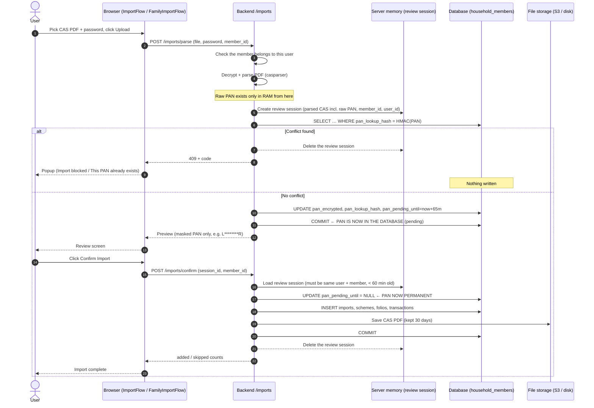
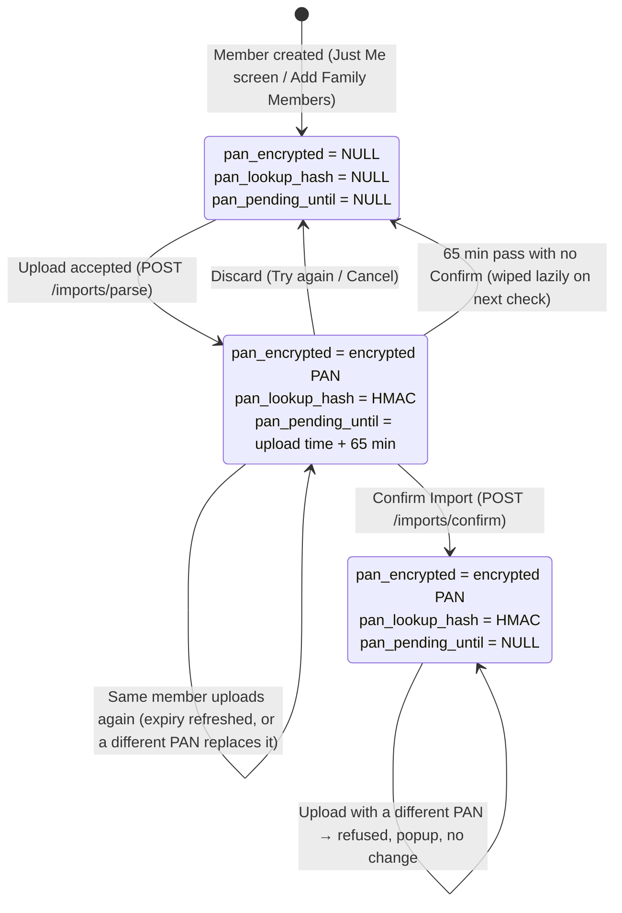
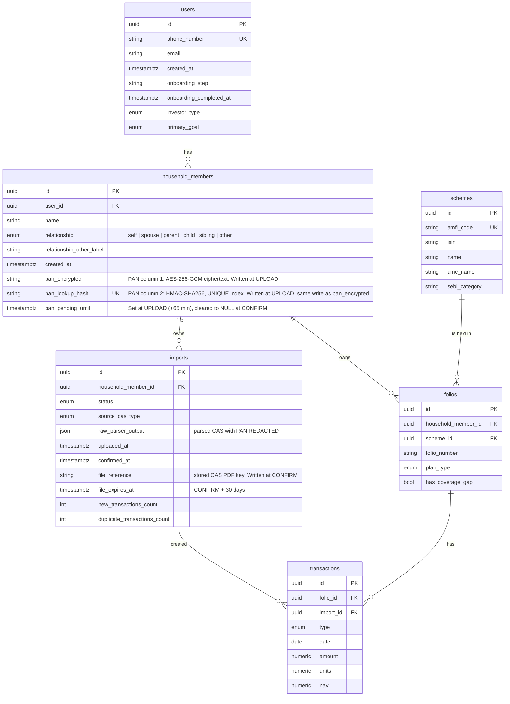

# PAN Storage: Flowchart & ER Diagram

**Date:** 2026-09-24
**Reflects:** the uncommitted PAN-at-upload change (spec `Docs/superpowers/specs/2026-09-24-pan-at-upload-attribution-design.md`)
**Code:** `backend/app/services/import_/pan_claims.py`, `service.py`, `api/imports.py`; `frontend/src/features/import/ImportFlow.tsx`, `features/auth/FamilyImportFlow.tsx`

> The diagrams are Mermaid. They render in VS Code's Markdown preview and on GitHub.

---

## 1. The short answer

PAN lives on **`household_members`**, in two columns, plus one status column:

| Column | What it holds | Written when | Screen at that moment |
|---|---|---|---|
| `pan_encrypted` | The real PAN, AES-256-GCM encrypted | **Upload**: the `/imports/parse` call, right after the file is read | "Parsing…" spinner, just before the Review screen appears |
| `pan_lookup_hash` | A one-way HMAC-SHA256 fingerprint of the PAN, used only to check "is this PAN already in Unifolio?" | **At the same moment, in the same database write** as `pan_encrypted` | The same "Parsing…" spinner |
| `pan_pending_until` | Not a PAN. It's a status timestamp. Set = the PAN is still *pending*. Empty = the PAN is *permanent*. | Set at **upload** (now + 65 min). Cleared (made empty) at **Confirm Import**. | Set on the spinner; cleared when you click **Confirm Import** |

**Key facts**

- **Both PAN columns go into the database together.** There is no step where one is saved and the other isn't. One `UPDATE household_members …` sets both, and one commit saves them.
- **Before that moment,** the PAN only exists in server memory, in the parsed CAS inside the review session. It's never written to disk in plain form.
- **Confirm Import doesn't touch the two PAN columns.** It only empties `pan_pending_until`, which turns the pending PAN into a permanent one.
- **An abandoned upload removes the PAN again.** All three columns are wiped if the user presses Try again or Cancel, or if 65 minutes pass without a Confirm.
- **A PAN conflict writes nothing.** That covers another family member, another account, or a different PAN from the one this member already has. The popup appears and the database is unchanged.

---

## 2. Just Me: full flow

```mermaid
flowchart TD
    A["Onboarding: Q4 Household screen"] -->|User clicks Just Me| B["SoloCasUpload screen loads"]
    B --> B1[("DB write 1<br/>INSERT household_members<br/>relationship = self<br/>pan_encrypted = NULL<br/>pan_lookup_hash = NULL<br/>pan_pending_until = NULL")]
    B1 --> C["Import screen: choose path<br/>(Request from CAMS / I already have a statement)"]
    C -->|I already have a statement| D["Upload form: pick CAS PDF + enter PDF password"]
    D -->|Clicks Upload Statement| E["'Parsing…' spinner shown"]
    E --> F["Browser → POST /imports/parse<br/>(file, password, household_member_id)"]
    F --> G{"Server: PDF valid<br/>and password correct?"}
    G -->|No| G1["Error screen with Try again<br/>(nothing written to DB)"]
    G -->|Yes| H["Server parses CAS in memory<br/>(raw PAN now in server memory only)"]
    H --> I["Server looks up fund details online (mfapi)<br/>and creates the review session in memory"]
    I --> J{"Server checks the PAN<br/>against household_members.pan_lookup_hash"}
    J -->|"PAN belongs to a<br/>different account"| K1["409 cross_account_pan_blocked<br/>(nothing written)"]
    K1 --> K1s["Popup: 'Import blocked'<br/>Back → household step"]
    J -->|"PAN belongs to another<br/>member of this account,<br/>or doesn't match this<br/>member's permanent PAN"| K2["409 pan_belongs_to_other_member /<br/>pan_mismatch_for_member<br/>(nothing written)"]
    K2 --> K2s["Popup: 'This PAN already exists'<br/>Change CAS file / Cancel → back to upload form"]
    J -->|"PAN is new, or already<br/>this member's"| L[("DB write 2: PAN ENTERS THE DATABASE<br/>UPDATE household_members SET<br/>pan_encrypted = encrypt(PAN)<br/>pan_lookup_hash = HMAC(PAN)<br/>pan_pending_until = now + 65 min<br/>→ COMMIT")]
    L --> M["Review screen: 'Review … CAS Import'<br/>(schemes, folios, transactions)"]
    M -->|User clicks Confirm Import| N["Browser → POST /imports/confirm"]
    N --> O[("DB write 3: PAN MADE PERMANENT<br/>UPDATE household_members<br/>SET pan_pending_until = NULL<br/>(pan_encrypted & pan_lookup_hash unchanged)")]
    O --> P[("DB write 4 (same transaction)<br/>INSERT imports (status = confirmed,<br/>file_reference, file_expires_at = +30 days)<br/>INSERT schemes (if new), folios, transactions<br/>CAS PDF saved to file storage (S3 / disk)<br/>→ COMMIT")]
    P --> Q["'Import complete' screen → next step"]
    M -.->|"User abandons: Try again after a<br/>failed confirm"| R["Browser → POST /imports/sessions/{id}/discard"]
    R --> S[("UPDATE household_members SET<br/>pan_encrypted = NULL, pan_lookup_hash = NULL,<br/>pan_pending_until = NULL → COMMIT")]
    M -.->|"User just closes the tab"| T["After 65 min the pending PAN counts as expired<br/>and is wiped the next time anyone checks that PAN"]

    classDef db fill:#fff4d6,stroke:#b8860b,color:#000
    classDef pan fill:#ffd6d6,stroke:#c0392b,color:#000,stroke-width:2px
    classDef popup fill:#e8e8ff,stroke:#5b5bd6,color:#000
    class B1,P,S db
    class L,O pan
    class K1s,K2s popup
```

**In a fresh Just Me account the popups can't normally appear.** There is only one member, and nobody has a PAN yet. The only possible one is "Import blocked", when the same CAS was already imported under another Unifolio account.

---

## 3. Family: full flow

Family is different in one important way. **Choosing files doesn't send anything to the server.** Files are queued in the browser, and each one is uploaded, and its PAN checked, only after **Import now**, one member at a time.

```mermaid
flowchart TD
    A["Onboarding: Q4 Household screen"] -->|User clicks Family Too| B["Add Family Members screen"]
    B -->|Each member added| B1[("DB write 1 (per member)<br/>INSERT household_members<br/>e.g. Mom, Dad<br/>all PAN columns = NULL")]
    B1 -->|Continue| C["Family CAS cards: one card per member"]
    C -->|"For each member: pick PDF + password<br/>(or Skip for now)"| C1["File QUEUED IN THE BROWSER ONLY<br/>nothing sent, nothing written"]
    C1 --> D["'Upload your own CAS?' screen"]
    D -->|Upload now| D1[("If no self member yet:<br/>INSERT household_members relationship = self<br/>PAN columns = NULL")]
    D1 --> D2["Own file also QUEUED in browser"]
    D -->|Upload later| E
    D2 --> E["Parse Queue screen: list of queued files"]
    E -->|User clicks Import now| F["Take the NEXT queued member (e.g. Mom)"]
    F --> G["'Parsing…' spinner<br/>Browser → POST /imports/parse<br/>(Mom's file, password, Mom's member id)"]
    G --> H{"PDF valid +<br/>password correct?"}
    H -->|No| H1["Per-member error screen<br/>Try again / Skip Mom for now<br/>(nothing written)"]
    H -->|Yes| I["Server parses CAS + looks up funds<br/>(PAN in server memory only)"]
    I --> J{"Server checks PAN against<br/>household_members.pan_lookup_hash"}
    J -->|"Any conflict:<br/>other account, other family member,<br/>or not Mom's permanent PAN"| K["409 (nothing written)"]
    K --> K1["Popup: 'This PAN already exists'<br/>'The statement you uploaded for Mom belongs to a PAN<br/>that's already in Unifolio. Please choose Mom's own CAS.'"]
    K1 -->|Change CAS file| K2["Upload form for Mom (with Back → popup)"]
    K2 -->|New file uploaded| G
    K1 -->|Skip Mom for now| X
    J -->|"PAN new, or already Mom's"| L[("DB write 2: PAN ENTERS THE DATABASE<br/>UPDATE household_members (Mom) SET<br/>pan_encrypted = encrypt(PAN)<br/>pan_lookup_hash = HMAC(PAN)<br/>pan_pending_until = now + 65 min<br/>→ COMMIT")]
    L --> M["Review screen: 'Review Mom's CAS Import'"]
    M -->|Confirm Import| N[("DB write 3: PAN MADE PERMANENT<br/>UPDATE household_members (Mom)<br/>SET pan_pending_until = NULL")]
    N --> O[("DB write 4 (same transaction)<br/>INSERT imports / folios / transactions<br/>CAS PDF saved, file_expires_at = +30 days<br/>→ COMMIT")]
    O --> X{"More queued members?"}
    X -->|"Yes (e.g. Dad)"| F
    X -->|No| Y["'Import complete' (all members combined) → Get my first score"]

    classDef db fill:#fff4d6,stroke:#b8860b,color:#000
    classDef pan fill:#ffd6d6,stroke:#c0392b,color:#000,stroke-width:2px
    classDef popup fill:#e8e8ff,stroke:#5b5bd6,color:#000
    classDef browser fill:#e6f7ea,stroke:#2e8b57,color:#000
    class B1,D1,O db
    class L,N pan
    class K1 popup
    class C1,D2 browser
```

**Why the queue order matters:** members are processed strictly one after another. Mom's PAN is permanent before Dad's file is uploaded. If Dad's slot contains Mom's statement by mistake, Dad's upload hits the conflict popup.

---

## 4. Timeline of one upload → confirm (what's in memory vs. the database)

---

## 5. Lifecycle of the PAN columns on one member

**The request-CAS email path** (`/cas-imports`) has no review screen. It goes straight from **Empty** to **Permanent** in one call. The current UI doesn't use it: its "I already have a statement" upload goes through `/imports/parse` like every other screen.

---

## 6. ER diagram (import-related tables)

**Where PAN is and isn't stored:**

| Place | PAN? |
|---|---|
| `household_members.pan_encrypted` | Yes, encrypted (recoverable only with the server key) |
| `household_members.pan_lookup_hash` | Yes, as a one-way fingerprint (cannot be turned back into the PAN) |
| `imports.raw_parser_output` | **No.** The PAN is removed before this is saved |
| Stored CAS PDF (`imports.file_reference`) | Inside the PDF itself, as the CAS prints it; deleted after 30 days |
| Any API response / screen | **No.** Only the masked form (`L********R`) |
| Server logs | **No.** Logs name the member id only |
| Server memory (review session) | Yes, raw, for at most 60 minutes, until Confirm / Discard / expiry |

**The unique index on `pan_lookup_hash`** is what enforces "one PAN, one member, across all of Unifolio". A *pending* PAN occupies it too. So while one member's review screen is open, no other member or account can claim the same PAN.
